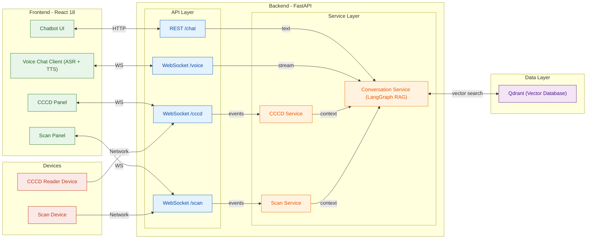
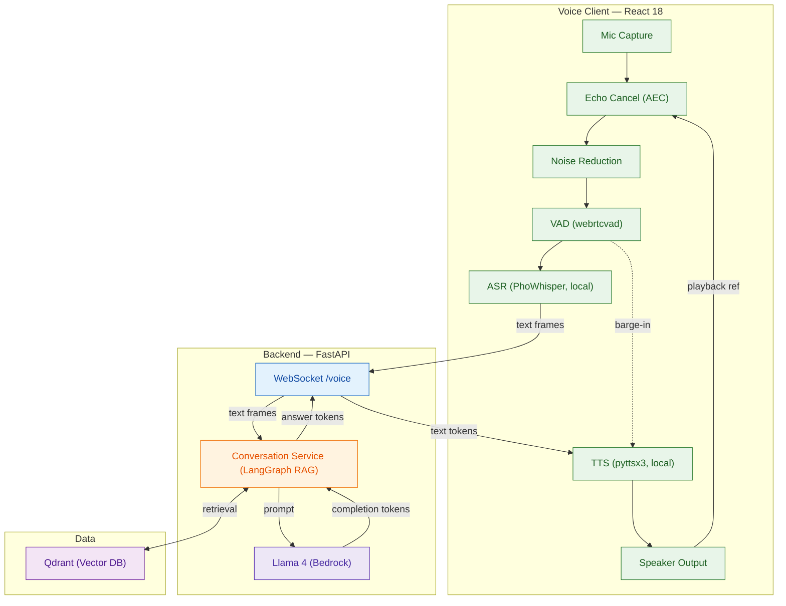
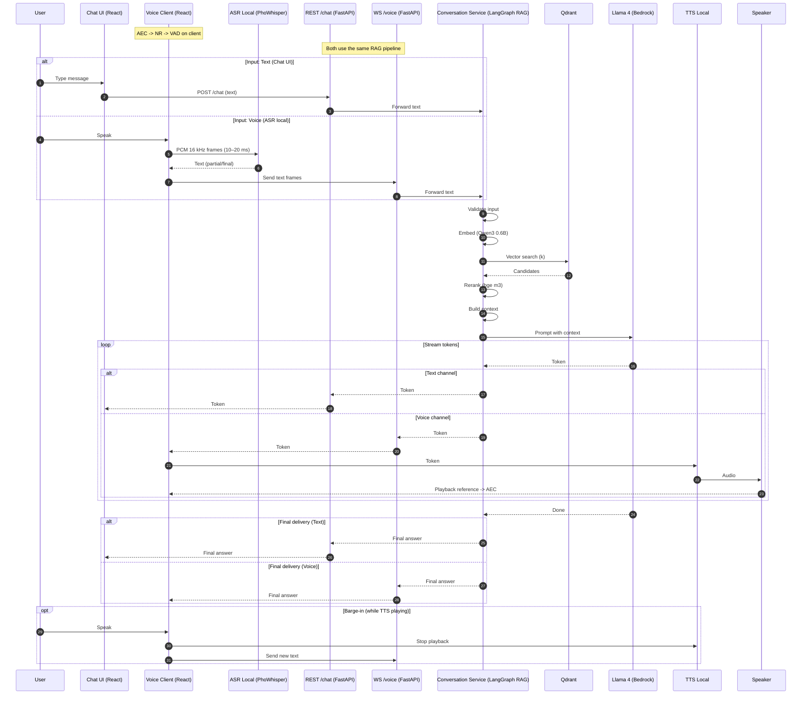

# Workflow Chi Tiết Toàn Bộ Hệ Thống

---

## 1) Kiến trúc hệ thống



### Mô tả hệ thống

**Frontend – React 18**

- **Chatbot UI**: gõ văn bản, nhận câu trả lời (HTTP).
- **Voice Chat Client (ASR + TTS)**: thu âm → ASR cục bộ → gửi text qua WebSocket → nhận token trả lời → TTS cục bộ, chống dội (AEC).
- **CCCD Panel**: ...
- **Scan Panel**: ...
  <!-- - **CCCD Panel**: nhận dữ liệu thẻ theo thời gian thực, hiển thị/điền form. -->
  <!-- - **Scan Panel**: nhận dữ liệu scan giấy tờ theo thời gian thực, hiển thị/điền form. -->

**Backend – FastAPI**

- **API Layer**

  - `REST /chat` (HTTP): nhận tin nhắn text từ Chatbot UI.
  - `WS /voice` (WebSocket): kênh hai chiều cho voice (client gửi **text frames**, server stream **tokens**).
  - `WS /cccd`, `WS /scan` (WebSocket): nhận **events** từ thiết bị, đẩy realtime lên panel.

- **Service Layer**

  - **Conversation Service (LangGraph RAG)**: pipeline dùng chung cho **text** và **voice** (validate → embed → Qdrant search → rerank → build context → LLM → validate).
  <!-- - **CCCD Service**: tiếp nhận/chuẩn hoá dữ liệu thẻ, kiểm tra hợp lệ, phát sự kiện lên FE, và **bơm “context”** sang Conversation Service khi cần.
  - **Scan Service**: tương tự cho giấy tờ scan. -->
  - **CCCD Service**: ...
  - **Scan Service**: tương tự cho giấy tờ scan.

**Data Layer**

- **Qdrant (Vector Database)**: nguồn tri thức cho RAG.

**Devices**

- **CCCD Reader Device**, **Scan Device**: kết nối mạng tới `WS /cccd` và `WS /scan`.

### 1.1 kiến trúc langgraph RAG

```mermaid
flowchart TB
  %% =================== STYLES ===================
  classDef op fill:#E3F2FD,stroke:#1565C0,stroke-width:1px,color:#0D47A1;
  classDef inj fill:#E0F7FA,stroke:#006064,stroke-width:1px,color:#004D40;
  classDef proc fill:#FFFDE7,stroke:#FBC02D,stroke-width:1px,color:#E65100;
  classDef store fill:#F1F8E9,stroke:#33691E,stroke-width:1px,color:#1B5E20;
  classDef ret fill:#E8F5E9,stroke:#2E7D32,stroke-width:1px,color:#1B5E20;
  classDef rank fill:#FFF8E1,stroke:#EF6C00,stroke-width:1px,color:#E65100;
  classDef gen fill:#F3E5F5,stroke:#6A1B9A,stroke-width:1px,color:#4A148C;
  classDef guard fill:#FFEBEE,stroke:#C62828,stroke-width:1px,color:#B71C1C;
  classDef out fill:#E8EAF6,stroke:#3949AB,stroke-width:1px,color:#1A237E;

  %% ================= INGESTION & INDEXING =================
  subgraph ING["Ingestion & Indexing"]
    direction TB

    %% --- Preprocess ---
    subgraph PRE["Preprocess"]
      direction TB
      SRC["Sources"]:::inj
      UP["Upload or Sync"]:::inj
      CR["Crawler"]:::inj
      PARSE["Parse (DOCX/MD/HTML)"]:::proc
      CLEAN["Clean & Normalize"]:::proc
      SRC -->|files| UP
      SRC -->|discovery| CR
      UP --> PARSE
      CR --> PARSE
      PARSE --> CLEAN
    end

    %% --- Branch by domain (side-by-side) ---
    subgraph BRANCH["Domain Branching"]
      direction LR
      %% Legal lane
      subgraph LEG["Legal (collection: legal)"]
        direction TB
        L_CHUNK["Chunk by Article"]:::proc
        L_META["Attach metadata"]:::proc
        L_EMB["Embed (Qwen3 0.6B)"]:::ret
        L_UPS["Upsert to Qdrant"]:::store
        L_CHUNK --> L_META --> L_EMB --> L_UPS
      end

      %% Procedure lane
      subgraph PROC["Procedure (collection: procedure)"]
        direction TB
        P_CHUNK["Chunk 4 sections"]:::proc
        P_META["Attach metadata"]:::proc
        P_EMB["Embed (Qwen3 0.6B)"]:::ret
        P_UPS["Upsert to Qdrant"]:::storeTrình tự xử lý (Sequence: Request → Answer)
        P_CHUNK --> P_META --> P_EMB --> P_UPS
      end
    end

    CLEAN --> L_CHUNK
    CLEAN --> P_CHUNK
  end

  %% ====================== RAG PIPELINE =====================
  subgraph RAG["LangGraph RAG"]
    direction TB

    %% 1) Input & Validation
    subgraph INP["1 · Input & Validation"]
      direction TB
      IN["Input (query + history)"]:::op
      VAL_IN["Validate (Guardrails)"]:::guard
      IN -->|text| VAL_IN
    end

    %% 2) Query Analysis (NOW STEP 2)
    subgraph ANAL["2 · Query Analysis"]
      direction TB
      QANA["Query Analysis"]:::op
    end

    %% 3) Retrieval (per-collection search)
    subgraph RETR["3 · Retrieval"]
      direction TB
      EMB["Embed (Qwen3 0.6B)"]:::ret
      S_LEGAL["Qdrant Search (collection: legal)"]:::ret
      S_PROC["Qdrant Search (collection: procedure)"]:::ret
      MERGE["Merge candidates"]:::ret
    end

    %% 4) Ranking & Context
    subgraph RNK["4 · Ranking & Context"]
      direction TB
      RER["Rerank (BAAI/bge-reranker-v2-m3)"]:::rank
      CTX["Build Context (top-k)"]:::rank
    end

    %% 5) Generation
    subgraph GENR["5 · Generation"]
      direction TB
      GEN["Generate (Llama 4 - Bedrock)"]:::gen
    end

    %% 6) Output Validation
    subgraph OUTV["6 · Output Validation"]
      direction TB
      VAL_OUT["Validate (Guardrails)"]:::guard
      OUT["Final Answer"]:::out
    end
  end

  %% --------- RAG Edges (between subgraphs) ---------
  VAL_IN -->|ok| QANA
  QANA -->|plan| EMB
  EMB -->|route legal| S_LEGAL
  EMB -->|route procedure| S_PROC
  S_LEGAL --> MERGE
  S_PROC --> MERGE
  MERGE -->|candidates| RER
  RER -->|top-k| CTX
  CTX -->|prompt| GEN
  GEN -->|completion| VAL_OUT
  VAL_OUT -->|safe| OUT

  %% ------------- Bridges from indexing to RAG -------------
  L_UPS -->|legal collection| S_LEGAL
  P_UPS -->|procedure collection| S_PROC


```

### 1.2 kiến trúc voice chatbot



### 1.3 CCCD

### 1.4 Scan

---

## 2) Trình tự xử lý (Sequence: Request → Answer)



---

## 3) Công nghệ & Frameworks

- **Frontend**: React 18 (SPA, WebSocket/HTTP, mic capture, UI).
- **Backend**: FastAPI (router `/chat`, REST & WebSocket).
- **RAG Orchestration**: LangGraph (state machine & nodes).
- **Vector Database**: Qdrant (HNSW/IVF, payload filter).
- **Embeddings**: Qwen3 0.6B.
- **Reranker**: BAAI/bge-reranker-v2-m3.
- **LLM**: Llama 4 trên AWS Bedrock (qua Boto3).
- **Observability**: Langfuse (tracing, errors, metrics, cost).
- **Guardrails**: Bedrock Guardrails (input/output moderation).

---

```mermaid
test ở đây
```
