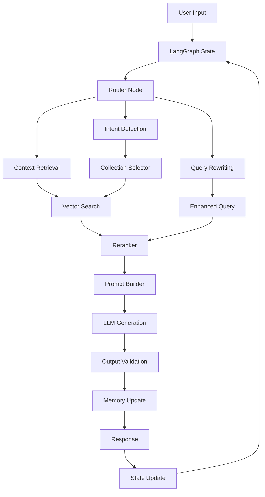

# 🚀 Tích Hợp LangGraph và LangChain cho RAG System

## 1. Tổng Quan

LangGraph và LangChain cung cấp một framework mạnh mẽ để xây dựng RAG system với:
- **State Management**: Quản lý trạng thái hội thoại
- **Conditional Logic**: Logic có điều kiện dựa trên context
- **Parallel Processing**: Xử lý song song các bước
- **Memory Management**: Quản lý bộ nhớ thông minh
- **Tool Integration**: Tích hợp tools và functions

## 2. Kiến Trúc Mới với LangGraph



## 3. Cài Đặt Dependencies

```bash
pip install langgraph langchain langchain-community langchain-core
pip install langchain-openai langchain-anthropic
pip install langchain-qdrant langchain-supabase
```

## 4. Implementation

### 4.1 State Management

```python
# agents/langgraph_state.py
from typing import TypedDict, List, Dict, Any, Optional
from langchain_core.messages import BaseMessage, HumanMessage, AIMessage
from langchain_core.documents import Document
from pydantic import BaseModel

class ChatState(TypedDict):
    """State cho LangGraph chat system"""
    messages: List[BaseMessage]
    question: str
    session_id: str
    intent: Optional[str]
    confidence: Optional[float]
    context_docs: List[Document]
    rewritten_query: Optional[str]
    sources: List[Dict[str, Any]]
    answer: Optional[str]
    error: Optional[str]
    metadata: Dict[str, Any]

class ConversationMemory(BaseModel):
    """Memory cho conversation context"""
    session_id: str
    messages: List[BaseMessage]
    context_summary: Optional[str]
    relevant_entities: List[str]
    conversation_turns: int
```

### 4.2 Graph Nodes

```python
# agents/langgraph_nodes.py
from typing import Dict, Any, List
from langchain_core.messages import HumanMessage, AIMessage
from langchain_core.documents import Document
from langgraph.graph import StateGraph, END
from langgraph.prebuilt import ToolNode
import logging

logger = logging.getLogger(__name__)

class RAGNodes:
    """Các nodes cho RAG system"""
    
    def __init__(self):
        self.intent_detector = intent_detector
        self.query_rewriter = QueryRewriter()
        self.context_manager = context_manager
        self.prompt_manager = prompt_manager
        
    def route_by_intent(self, state: Dict[str, Any]) -> str:
        """Route dựa trên intent"""
        question = state["question"]
        intent, metadata = self.intent_detector.detect_intent(question)
        state["intent"] = intent.value
        state["confidence"] = metadata.get("confidence", 0.0)
        
        # Route logic
        if intent.value == "law":
            return "law_search"
        elif intent.value == "form":
            return "form_search"
        elif intent.value == "procedure":
            return "procedure_search"
        else:
            return "general_search"
    
    def rewrite_query_with_context(self, state: Dict[str, Any]) -> Dict[str, Any]:
        """Rewrite query với conversation context"""
        question = state["question"]
        messages = state["messages"]
        
        # Extract context từ messages
        context_string = self.context_manager.extract_context_from_messages(messages)
        
        # Rewrite query
        rewritten = self.query_rewriter.rewrite_with_context(question, context_string)
        state["rewritten_query"] = rewritten
        
        logger.info(f"Query rewritten: {question} -> {rewritten}")
        return state
    
    def retrieve_context(self, state: Dict[str, Any]) -> Dict[str, Any]:
        """Retrieve context documents"""
        query = state.get("rewritten_query", state["question"])
        intent = state["intent"]
        
        # Get embedding
        embedding = get_embedding(query)
        
        # Search based on intent
        collections = intent_detector.get_search_collections(intent, state["confidence"])
        all_docs = []
        
        for collection in collections:
            results = search_qdrant(collection, embedding, limit=15)
            docs = [Document(page_content=r.payload.get("text", ""), 
                           metadata=r.payload) for r in results]
            all_docs.extend(docs)
        
        # Rerank with BGE
        if all_docs:
            reranker = get_reranker()
            reranked_docs = reranker.rerank(
                query=query,
                documents=[{"content": doc.page_content} for doc in all_docs],
                top_k=15
            )
            
            # Update docs with rerank scores
            for i, doc in enumerate(all_docs[:len(reranked_docs)]):
                doc.metadata["rerank_score"] = reranked_docs[i].get("rerank_score", 0.0)
        
        state["context_docs"] = all_docs[:15]
        return state
    
    def generate_answer(self, state: Dict[str, Any]) -> Dict[str, Any]:
        """Generate answer với context"""
        question = state["question"]
        docs = state["context_docs"]
        intent = state["intent"]
        
        # Create prompt
        prompt = self.prompt_manager.create_dynamic_prompt(
            question=question,
            chunks=[doc.metadata for doc in docs],
            intent=intent
        )
        
        # Generate answer
        answer = call_llm_full(prompt)
        state["answer"] = answer
        
        # Extract sources
        sources = []
        for doc in docs[:5]:  # Top 5 sources
            source = {
                "law_name": doc.metadata.get("law_name", "Nguồn"),
                "article": doc.metadata.get("article"),
                "chapter": doc.metadata.get("chapter"),
                "score": doc.metadata.get("rerank_score", 0.0)
            }
            sources.append(source)
        
        state["sources"] = sources
        return state
    
    def validate_output(self, state: Dict[str, Any]) -> Dict[str, Any]:
        """Validate output với guardrails"""
        answer = state["answer"]
        
        # Guardrails check
        output_safety = guardrails.validate_output(answer)
        if not output_safety["is_safe"]:
            fallback_msg = guardrails.get_fallback_message(output_safety["block_reason"])
            state["answer"] = fallback_msg
            state["error"] = "output_validation_failed"
        
        return state
    
    def update_memory(self, state: Dict[str, Any]) -> Dict[str, Any]:
        """Update conversation memory"""
        session_id = state["session_id"]
        messages = state["messages"]
        
        # Add new messages
        if state["answer"]:
            messages.append(AIMessage(content=state["answer"]))
        
        # Update context summary
        context_summary = self.context_manager.create_context_summary(messages)
        
        # Update state
        state["messages"] = messages
        state["metadata"]["context_summary"] = context_summary
        
        return state

# Initialize nodes
rag_nodes = RAGNodes()
```

### 4.3 Graph Construction

```python
# agents/langgraph_workflow.py
from langgraph.graph import StateGraph, END
from langgraph.checkpoint.memory import MemorySaver
from langgraph.prebuilt import ToolNode
import logging

logger = logging.getLogger(__name__)

def create_rag_workflow():
    """Tạo RAG workflow với LangGraph"""
    
    # Create workflow
    workflow = StateGraph(ChatState)
    
    # Add nodes
    workflow.add_node("route", rag_nodes.route_by_intent)
    workflow.add_node("rewrite", rag_nodes.rewrite_query_with_context)
    workflow.add_node("retrieve", rag_nodes.retrieve_context)
    workflow.add_node("generate", rag_nodes.generate_answer)
    workflow.add_node("validate", rag_nodes.validate_output)
    workflow.add_node("update_memory", rag_nodes.update_memory)
    
    # Add edges
    workflow.add_edge("route", "rewrite")
    workflow.add_edge("rewrite", "retrieve")
    workflow.add_edge("retrieve", "generate")
    workflow.add_edge("generate", "validate")
    workflow.add_edge("validate", "update_memory")
    workflow.add_edge("update_memory", END)
    
    # Add conditional edges for routing
    workflow.add_conditional_edges(
        "route",
        rag_nodes.route_by_intent,
        {
            "law_search": "rewrite",
            "form_search": "rewrite", 
            "procedure_search": "rewrite",
            "general_search": "rewrite"
        }
    )
    
    # Compile workflow
    app = workflow.compile(checkpointer=MemorySaver())
    
    return app

# Create workflow instance
rag_workflow = create_rag_workflow()
```

### 4.4 LangChain Integration

```python
# agents/langchain_components.py
from langchain_core.prompts import ChatPromptTemplate, MessagesPlaceholder
from langchain_core.output_parsers import StrOutputParser
from langchain_core.runnables import RunnablePassthrough
from langchain_community.vectorstores import Qdrant
from langchain_community.embeddings import HuggingFaceEmbeddings
from langchain_core.documents import Document
from langchain.memory import ConversationBufferWindowMemory
from langchain.chains import ConversationalRetrievalChain
import logging

logger = logging.getLogger(__name__)

class LangChainRAGComponents:
    """LangChain components cho RAG"""
    
    def __init__(self):
        self.embeddings = HuggingFaceEmbeddings(
            model_name="Alibaba-NLP/gte-multilingual-base",
            model_kwargs={'device': 'cuda'},
            encode_kwargs={'normalize_embeddings': True}
        )
        
        # Initialize vector stores
        self.vector_stores = {
            "law": Qdrant.from_texts(
                texts=[],  # Will be populated from existing data
                embedding=self.embeddings,
                collection_name="legal_chunks"
            ),
            "form": Qdrant.from_texts(
                texts=[],
                embedding=self.embeddings, 
                collection_name="form_chunks"
            ),
            "procedure": Qdrant.from_texts(
                texts=[],
                embedding=self.embeddings,
                collection_name="procedure_chunks"
            )
        }
        
        # Memory
        self.memory = ConversationBufferWindowMemory(
            k=10,
            return_messages=True,
            memory_key="chat_history"
        )
    
    def create_retrieval_chain(self, intent: str):
        """Tạo retrieval chain cho intent cụ thể"""
        vector_store = self.vector_stores.get(intent, self.vector_stores["law"])
        
        # Prompt template
        template = """Bạn là trợ lý pháp lý chuyên về pháp luật hành chính và cư trú tại Việt Nam.

Lịch sử hội thoại:
{chat_history}

Câu hỏi hiện tại: {question}

Thông tin tham khảo:
{context}

Hướng dẫn:
1. Trả lời dựa trên thông tin được cung cấp
2. Nếu không có thông tin đủ, hãy nêu rõ
3. Đưa ra hướng dẫn thực tế và khả thi
4. Trích dẫn nguồn thông tin khi cần thiết

Trả lời:"""

        prompt = ChatPromptTemplate.from_template(template)
        
        # Chain
        chain = (
            {"context": vector_store.as_retriever(), 
             "question": RunnablePassthrough(),
             "chat_history": RunnablePassthrough()}
            | prompt
            | llm
            | StrOutputParser()
        )
        
        return chain
    
    def create_conversational_chain(self):
        """Tạo conversational retrieval chain"""
        # Multi-vector store retriever
        retrievers = list(self.vector_stores.values())
        
        # Conversational chain
        chain = ConversationalRetrievalChain.from_llm(
            llm=llm,
            retriever=retrievers[0],  # Use law as default
            memory=self.memory,
            return_source_documents=True,
            verbose=True
        )
        
        return chain

# Initialize components
langchain_components = LangChainRAGComponents()
```

### 4.5 Enhanced Chat Router

```python
# routers/langgraph_chat.py
from fastapi import APIRouter, HTTPException
from fastapi.responses import StreamingResponse
from datetime import datetime
import uuid
import time
import json
import logging
from models.schemas import ChatRequest, ChatResponse
from agents.langgraph_workflow import rag_workflow
from agents.langchain_components import langchain_components
from langchain_core.messages import HumanMessage
import asyncio

logger = logging.getLogger(__name__)

router = APIRouter(prefix="/langgraph-chat", tags=["LangGraph Chat"])

@router.post("/", response_model=ChatResponse)
async def langgraph_chat(request: ChatRequest):
    """Chat endpoint sử dụng LangGraph"""
    try:
        total_start = time.time()
        session_id = request.session_id or str(uuid.uuid4())
        
        # Convert messages to LangChain format
        messages = []
        if hasattr(request, 'messages') and request.messages:
            for msg in request.messages:
                if msg.get('role') == 'user':
                    messages.append(HumanMessage(content=msg.get('content', '')))
                elif msg.get('role') == 'assistant':
                    messages.append(AIMessage(content=msg.get('content', '')))
        
        # Add current question
        messages.append(HumanMessage(content=request.question))
        
        # Initial state
        initial_state = {
            "messages": messages,
            "question": request.question,
            "session_id": session_id,
            "intent": None,
            "confidence": None,
            "context_docs": [],
            "rewritten_query": None,
            "sources": [],
            "answer": None,
            "error": None,
            "metadata": {}
        }
        
        # Run workflow
        config = {"configurable": {"thread_id": session_id}}
        result = await rag_workflow.ainvoke(initial_state, config)
        
        # Extract results
        answer = result.get("answer", "")
        sources = result.get("sources", [])
        
        # Save to database
        try:
            save_chat_message(
                session_id=session_id,
                question=request.question,
                answer=answer,
                sources=sources
            )
        except Exception as e:
            logger.error(f"Không thể lưu chat history: {e}")
        
        total_end = time.time()
        logger.info(f"[LangGraph] Tổng thời gian xử lý: {total_end-total_start:.4f}s")
        
        return ChatResponse(
            answer=answer,
            sources=[Source(**src) for src in sources],
            session_id=session_id,
            timestamp=datetime.now().isoformat()
        )
        
    except Exception as e:
        logger.error(f"Exception in LangGraph chat: {e}")
        raise HTTPException(status_code=500, detail=str(e))

@router.post("/stream")
async def langgraph_chat_stream(request: ChatRequest):
    """Streaming chat endpoint với LangGraph"""
    try:
        # Similar to non-streaming but with streaming response
        # Implementation depends on LangGraph streaming capabilities
        
        def stream_response():
            # Stream implementation
            yield "data: {\"type\": \"start\"}\n\n"
            
            # Process with LangGraph
            # ... implementation details
            
            yield "data: {\"type\": \"end\"}\n\n"
        
        return StreamingResponse(stream_response(), media_type="text/plain")
        
    except Exception as e:
        logger.error(f"Exception in LangGraph stream: {e}")
        raise HTTPException(status_code=500, detail=str(e))

@router.post("/conversational")
async def conversational_chat(request: ChatRequest):
    """Conversational chat sử dụng LangChain ConversationalRetrievalChain"""
    try:
        # Use LangChain conversational chain
        chain = langchain_components.create_conversational_chain()
        
        # Run chain
        result = chain.invoke({
            "question": request.question
        })
        
        answer = result.get("answer", "")
        source_docs = result.get("source_documents", [])
        
        # Convert source documents to sources
        sources = []
        for doc in source_docs:
            source = {
                "law_name": doc.metadata.get("law_name", "Nguồn"),
                "article": doc.metadata.get("article"),
                "chapter": doc.metadata.get("chapter")
            }
            sources.append(source)
        
        return ChatResponse(
            answer=answer,
            sources=[Source(**src) for src in sources],
            session_id=request.session_id or str(uuid.uuid4()),
            timestamp=datetime.now().isoformat()
        )
        
    except Exception as e:
        logger.error(f"Exception in conversational chat: {e}")
        raise HTTPException(status_code=500, detail=str(e))
```

## 5. Lợi Ích của LangGraph + LangChain

### 5.1 So sánh với RAG truyền thống

| Tính năng | RAG Truyền thống | LangGraph + LangChain |
|-----------|------------------|----------------------|
| State Management | Manual | Built-in |
| Conditional Logic | Hard-coded | Dynamic routing |
| Memory | Basic | Advanced conversation memory |
| Parallel Processing | Limited | Native support |
| Tool Integration | Manual | Built-in tools |
| Debugging | Difficult | Visual debugging |
| Scalability | Limited | Highly scalable |

### 5.2 Cải tiến Performance

1. **Parallel Processing**: Có thể chạy song song các bước không phụ thuộc
2. **Caching**: Built-in caching cho intermediate results
3. **Memory Management**: Quản lý memory thông minh
4. **Conditional Execution**: Chỉ chạy các bước cần thiết

### 5.3 Monitoring và Debugging

```python
# agents/langgraph_monitoring.py
from langgraph.checkpoint import BaseCheckpointer
from langgraph.graph import StateGraph
import logging

class LangGraphMonitor:
    """Monitoring cho LangGraph workflows"""
    
    def __init__(self):
        self.logger = logging.getLogger(__name__)
    
    def log_node_execution(self, node_name: str, state: dict, duration: float):
        """Log node execution"""
        self.logger.info(f"[LangGraph] Node {node_name} executed in {duration:.4f}s")
        self.logger.info(f"[LangGraph] State keys: {list(state.keys())}")
    
    def log_workflow_completion(self, workflow_id: str, total_duration: float):
        """Log workflow completion"""
        self.logger.info(f"[LangGraph] Workflow {workflow_id} completed in {total_duration:.4f}s")
    
    def create_visualization(self, workflow: StateGraph):
        """Tạo visualization cho workflow"""
        # LangGraph có built-in visualization
        return workflow.get_graph().draw_mermaid()

# Initialize monitor
langgraph_monitor = LangGraphMonitor()
```

## 6. Migration Strategy

### 6.1 Phase 1: Parallel Implementation
- Giữ nguyên RAG system hiện tại
- Implement LangGraph version song song
- Test và so sánh performance

### 6.2 Phase 2: Gradual Migration
- Migrate từng endpoint một
- Monitor performance và accuracy
- Gather user feedback

### 6.3 Phase 3: Full Migration
- Hoàn thành migration
- Optimize và fine-tune
- Deploy production

## 7. Configuration

```python
# config/langgraph_config.py
from pydantic import BaseModel
from typing import Dict, Any

class LangGraphConfig(BaseModel):
    """Configuration cho LangGraph"""
    
    # Memory settings
    max_memory_turns: int = 10
    memory_window: int = 5
    
    # Routing settings
    intent_threshold: float = 0.7
    confidence_threshold: float = 0.8
    
    # Retrieval settings
    max_docs_per_collection: int = 15
    rerank_top_k: int = 10
    
    # Generation settings
    max_tokens: int = 2048
    temperature: float = 0.7
    
    # Monitoring settings
    enable_visualization: bool = True
    log_level: str = "INFO"

# Load config
langgraph_config = LangGraphConfig()
```

## 8. Testing

```python
# tests/test_langgraph_rag.py
import pytest
from agents.langgraph_workflow import rag_workflow
from agents.langchain_components import langchain_components

class TestLangGraphRAG:
    """Test cases cho LangGraph RAG"""
    
    def test_basic_workflow(self):
        """Test basic workflow execution"""
        # Test implementation
        pass
    
    def test_intent_routing(self):
        """Test intent-based routing"""
        # Test implementation
        pass
    
    def test_memory_management(self):
        """Test conversation memory"""
        # Test implementation
        pass
    
    def test_error_handling(self):
        """Test error handling"""
        # Test implementation
        pass
```

## 9. Deployment

### 9.1 Docker Configuration

```dockerfile
# Dockerfile.langgraph
FROM python:3.11-slim

WORKDIR /app

# Install dependencies
COPY requirements-langgraph.txt .
RUN pip install -r requirements-langgraph.txt

# Copy application
COPY . .

# Expose port
EXPOSE 8000

# Run application
CMD ["uvicorn", "main:app", "--host", "0.0.0.0", "--port", "8000"]
```

### 9.2 Environment Variables

```bash
# .env.langgraph
LANGGRAPH_ENABLED=true
LANGCHAIN_TRACING_V2=true
LANGCHAIN_ENDPOINT=https://api.smith.langchain.com
LANGCHAIN_API_KEY=your_api_key
LANGCHAIN_PROJECT=your_project
```

## 10. Kết Luận

LangGraph và LangChain cung cấp một framework mạnh mẽ để xây dựng RAG system hiện đại với:

- **State Management**: Quản lý trạng thái hội thoại tốt hơn
- **Conditional Logic**: Logic có điều kiện linh hoạt
- **Memory Management**: Bộ nhớ thông minh cho conversation
- **Tool Integration**: Tích hợp tools dễ dàng
- **Monitoring**: Debugging và monitoring tốt hơn
- **Scalability**: Khả năng mở rộng cao

Việc tích hợp này sẽ cải thiện đáng kể performance, accuracy và user experience của hệ thống chatbot. 