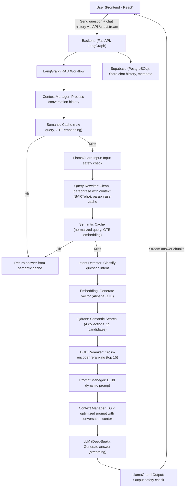
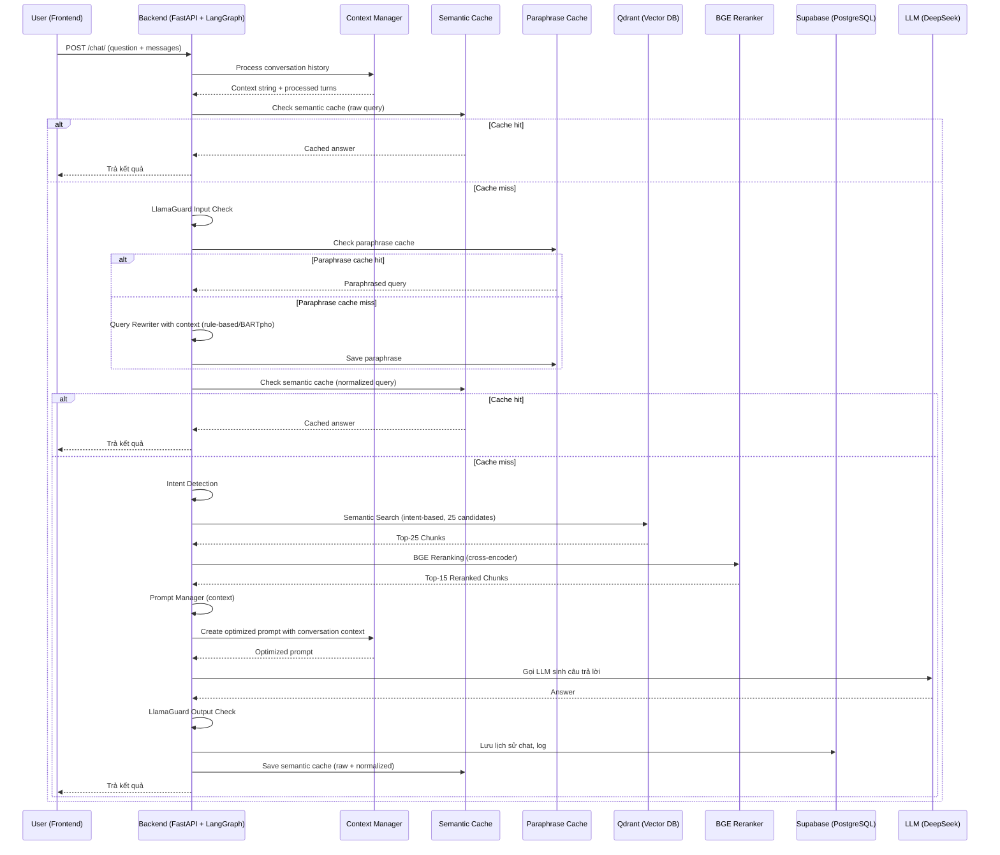

## 🛠️ Workflow Chi Tiết Toàn Bộ Hệ Thống (Cập nhật mới nhất)

### 1. Luồng Xử Lý Tổng Thể (LangGraph-based)

### 2. Mô Tả Chi Tiết Từng Bước (LangGraph-based)

A. **Frontend (React 18)**
   - Người dùng nhập câu hỏi, gửi request qua API `/chat/` hoặc `/chat/stream`.
   - Gửi kèm `messages` array chứa lịch sử hội thoại.
   - Nhận kết quả trả về dạng streaming (từng đoạn text), lịch sử chat, trạng thái đang xử lý.

B. **Backend (FastAPI + LangGraph)**
  1. Nhận request
    Sinh session_id nếu chưa có.
    Chuẩn hóa lịch sử hội thoại.
  
  2. LangGraph RAG Workflow
    - Context Manager: Xử lý, tóm tắt, chọn các lượt hội thoại liên quan nhất (giới hạn 3-5 turn, tóm tắt nếu quá dài).
    - Semantic Cache: Kiểm tra cache semantic (embedding) với câu hỏi gốc. Nếu có, trả kết quả luôn.
    - Guardrails Input: Kiểm tra an toàn đầu vào (LlamaGuard).
    - Query Rewriter: Làm sạch, paraphrase câu hỏi với context (rule-based + LLM nếu cần).
    - Semantic Cache (normalized): Kiểm tra cache với câu hỏi đã rewrite.
    - Intent Detector: Phân loại intent (law, form, term, procedure, ambiguous).
    - Embedding: Sinh vector embedding cho câu hỏi (PhoBERT/GTE).
    - Qdrant Search: Tìm kiếm semantic trong các collection tương ứng (top 25).
    - BGE Reranker: Rerank các kết quả bằng cross-encoder, chọn top 15.
    - Prompt Manager: Tạo prompt động phù hợp intent, chèn context, metadata.
    - LLM (DeepSeek): Sinh câu trả lời dựa trên prompt (streaming từng đoạn).
    - Guardrails Output: Kiểm tra an toàn đầu ra (LlamaGuard).
    - Lưu lịch sử: Lưu lại câu hỏi, câu trả lời, nguồn, intent, v.v. vào Supabase.
  
  3. Trả kết quả
    - Trả về frontend từng đoạn text (streaming), giúp UI hiển thị liên tục.

### 3. Sơ Đồ Luồng Dữ Liệu (Data Flow, LangGraph-based)

