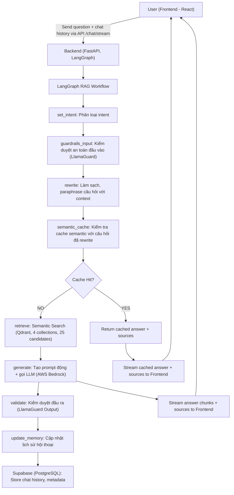
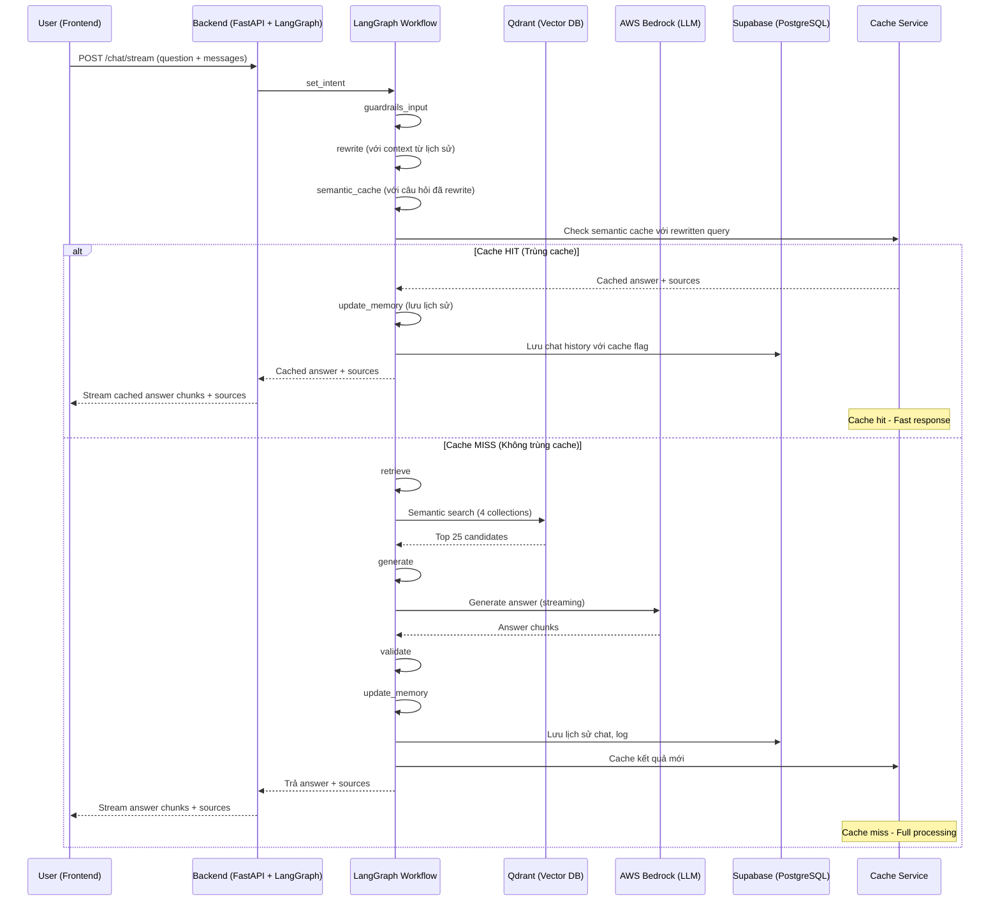

## 🛠️ Workflow Chi Tiết Toàn Bộ Hệ Thống (Cập nhật mới nhất - LangGraph-based)

### 1. Luồng Xử Lý Tổng Thể (LangGraph-based)


### 2. Mô tả chi tiết từng bước

**A. Frontend (React 18)**
- Người dùng nhập câu hỏi và gửi request qua API `/chat/stream`.
- Gửi kèm mảng `messages` chứa lịch sử hội thoại.
- **Nhận kết quả trả về dạng streaming:**
  - Các chunk `"type": "chunk"` chứa nội dung trả lời.
  - Chunk `"type": "sources"` chứa metadata nguồn tham khảo (bao gồm cả file mẫu, link tải về...).
- **Hiển thị:**
  - Nội dung trả lời.
  - Nếu có file mẫu trong sources, **hiện nút tải về nổi bật** phía dưới.
  - Khi bấm "Hiện nguồn tham khảo", hiển thị đúng thông tin nguồn (luật hoặc biểu mẫu, có link tải nếu là mẫu).

**B. Backend (FastAPI + LangGraph)**
- Nhận request, sinh `session_id` nếu chưa có, chuẩn hóa lịch sử hội thoại.
- **LangGraph RAG Workflow:**

#### Bước 1-4: Xử lý chung
1. **set_intent:** Phân loại intent (law, form, term, procedure, template, ambiguous).
2. **guardrails_input:** Kiểm duyệt an toàn đầu vào (LlamaGuard Input). Nếu vi phạm, trả về thông báo an toàn.
3. **rewrite:** Làm sạch, paraphrase câu hỏi với context từ lịch sử hội thoại (rule-based + LLM nếu cần).
4. **semantic_cache:** Kiểm tra cache semantic với câu hỏi đã được rewrite.

#### Nhánh A: Cache Hit (Trùng cache)
**Khi tìm thấy câu hỏi tương tự trong cache:**
- **Lấy kết quả cache:** Trích xuất answer và sources từ cache
- **Cập nhật metadata:** Ghi log cache hit, thời gian xử lý
- **Stream kết quả:** Gửi cached answer và sources về frontend
- **Bỏ qua các bước:** Không cần retrieve, generate, validate
- **Lưu lịch sử:** Vẫn lưu vào Supabase để tracking

#### Nhánh B: Cache Miss (Không trùng cache)
**Khi không tìm thấy câu hỏi tương tự trong cache:**
5. **retrieve:** Tìm kiếm semantic trong các collection tương ứng (top 25).
6. **generate:** Tạo prompt động phù hợp intent, chèn context và metadata.
7. **validate:** Kiểm duyệt đầu ra (LlamaGuard Output).
8. **update_memory:** Lưu lại câu hỏi, câu trả lời, nguồn, intent, v.v. vào Supabase.
9. **Cache kết quả:** Lưu kết quả mới vào semantic cache cho lần sau.

### 3. Sơ Đồ Luồng Dữ Liệu Chi Tiết (Data Flow, LangGraph-based)



### 4. Chi Tiết Xử Lý Cache Hit vs Cache Miss

#### 🔄 **Cache Hit Scenario:**
```json
{
  "processing_flow": "cache_hit",
  "steps_executed": ["set_intent", "guardrails_input", "rewrite", "semantic_cache"],
  "cache_data": {
    "original_query": "Làm thế nào để đăng ký thường trú?",
    "rewritten_query": "Làm thế nào để đăng ký thường trú theo quy định hiện hành?",
    "cached_answer": "Để đăng ký thường trú, bạn cần...",
    "cached_sources": [...],
    "cache_timestamp": "2024-01-15T10:30:00Z",
    "similarity_score": 0.95
  },
  "performance_metrics": {
    "total_processing_time": "0.2s",
    "cache_lookup_time": "0.05s",
    "saved_processing_time": "3.8s"
  }
}
```

#### ⚡ **Cache Miss Scenario:**
```json
{
  "processing_flow": "cache_miss",
  "steps_executed": ["set_intent", "guardrails_input", "rewrite", "semantic_cache", "retrieve", "generate", "validate", "update_memory"],
  "processing_details": {
    "intent": "procedure",
    "confidence": 0.89,
    "collections_searched": ["procedure_chunks", "legal_chunks"],
    "documents_retrieved": 25,
    "documents_reranked": 8,
    "llm_model": "llama-4-scout-17b",
    "prompt_tokens": 2048,
    "response_tokens": 512
  },
  "performance_metrics": {
    "total_processing_time": "4.2s",
    "retrieval_time": "0.8s",
    "generation_time": "2.5s",
    "validation_time": "0.3s"
  }
}
```

### 5. Cấu trúc dữ liệu và API

**ChatRequest:**
```json
{
  "question": "string",
  "session_id": "string (optional)",
  "messages": [
    {"role": "user|assistant", "content": "string"}
  ]
}
```

**Streaming Response:**
```json
// Chunk nội dung
{"type": "chunk", "content": "string"}

// Sources metadata
{"type": "sources", "sources": [
  {
    "title": "string",
    "code": "string",
    "file_url": "string",
    "url": "string",
    "content": "string",
    "metadata": {}
  }
]}

// Kết thúc
{"type": "done"}
```

### 6. Chi tiết xử lý sources

- **Backend:**
  - Khi truy vấn liên quan đến biểu mẫu, backend lấy metadata (file_url, code, title, ...) từ Qdrant hoặc nguồn dữ liệu.
  - Sau khi stream xong nội dung trả lời, backend gửi chunk `{"type": "sources", "sources": [...]}` cho frontend.
- **Frontend:**
  - Khi nhận chunk `type: sources`, frontend gán vào message bot cuối cùng.
  - Component Message.js sẽ tự động hiển thị nút tải về nếu có file_url, và hiển thị nguồn tham khảo đúng loại (luật, biểu mẫu, ...).

### 7. Tối Ưu Hóa Hiệu Suất

#### 🚀 **Cache Hit Benefits:**
- **Thời gian phản hồi:** Giảm từ ~4s xuống ~0.2s
- **Tiết kiệm tài nguyên:** Không cần gọi LLM và search
- **Trải nghiệm người dùng:** Phản hồi nhanh hơn
- **Chi phí:** Giảm chi phí API calls

#### 📊 **Cache Miss Processing:**
- **Full RAG pipeline:** Chạy đầy đủ 8 bước
- **Semantic search:** Tìm kiếm trong 4 collections
- **LLM generation:** Tạo câu trả lời mới
- **Quality assurance:** Validate an toàn
- **Cache storage:** Lưu kết quả cho lần sau

### 8. Tóm tắt các điểm mới nổi bật

- **Backend luôn trả về sources (bao gồm file_url, code, title...) trong chunk riêng biệt.**
- **Frontend tự động nhận sources và render nút tải về mẫu, hiển thị nguồn tham khảo đúng loại (luật, biểu mẫu...).**
- **Không còn link dài ngoằng trong nội dung trả lời.**
- **UX tốt hơn, người dùng dễ dàng tải file mẫu và xem nguồn tham khảo.**
- **LangGraph workflow với 8 bước xử lý tuần tự.**
- **Streaming thực sự từ AWS Bedrock LLM.**
- **Semantic cache với câu hỏi đã được rewrite để tối ưu hiệu suất.**
- **Guardrails an toàn đầu vào và đầu ra.**
- **Xử lý thông minh cho cache hit/miss với performance metrics chi tiết.**


