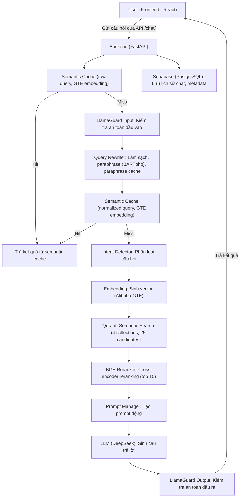
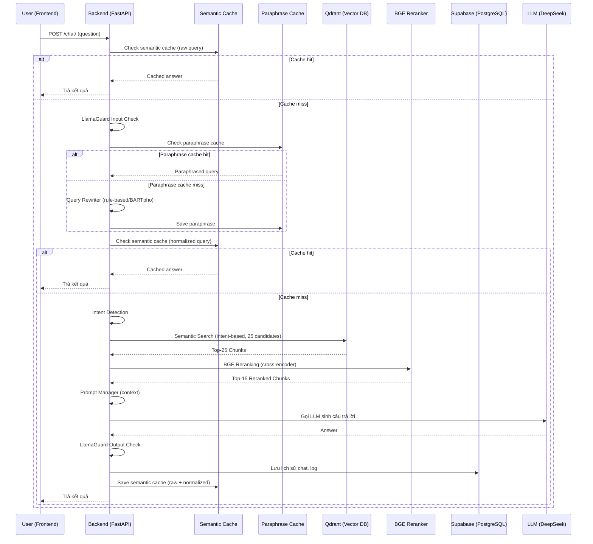

## 🛠️ Workflow Chi Tiết Toàn Bộ Hệ Thống (Cập nhật mới)

### 1. Luồng Xử Lý Tổng Thể

### 2. Mô Tả Chi Tiết Từng Bước (Cập nhật)

1. **Frontend (React 18)**
   - Người dùng nhập câu hỏi, gửi request qua API `/chat/` hoặc `/chat/stream`.
   - Hiển thị kết quả trả về, lịch sử chat, trạng thái đang xử lý.

2. **Backend (FastAPI)**
   - Nhận request, sinh session_id nếu chưa có.
   - **Semantic Cache (raw query):**
     - Tính embedding bằng Alibaba-NLP/gte-multilingual-base.
     - Nếu similarity với cache >= threshold, trả về kết quả luôn.
   - Nếu không hit cache:
     - Gọi LlamaGuard Input Policy kiểm tra an toàn đầu vào.
     - Gọi Query Rewriter để làm sạch, paraphrase (ưu tiên rule-based, paraphrase bằng BARTpho nếu cần), cache paraphrase.
     - **Semantic Cache (normalized query):**
       - Tính embedding normalized query, check cache.
       - Nếu hit, trả về kết quả luôn.
   - Nếu không hit cache:
     - Intent Detector xác định loại câu hỏi (law, form, term, procedure, ambiguous).
     - Sinh embedding cho câu hỏi bằng Alibaba GTE.
     - Truy vấn Qdrant (vector DB) theo intent, lấy 25 chunk liên quan từ 1 hoặc nhiều collection.
     - Áp dụng BGE Reranker để cải thiện ranking quality, chọn top 15 kết quả.
     - Gọi Prompt Manager để tạo prompt động, format context phù hợp intent.
     - Gọi LLM (DeepSeek V3) sinh câu trả lời dựa trên prompt và context.
     - Kiểm tra an toàn đầu ra bằng LlamaGuard Output Policy.
     - Lưu lịch sử chat, metadata vào Supabase (PostgreSQL).
     - Lưu kết quả vào semantic cache (cả raw và normalized query).
     - Trả kết quả về frontend (answer, sources, intent, confidence, timestamp).

3. **Qdrant (Vector DB)**
   - Lưu trữ embedding của 4 loại dữ liệu (laws, forms, terms, procedures).
   - Hỗ trợ truy vấn semantic search theo vector embedding.
   - Trả về 25 chunk dữ liệu liên quan nhất cho backend.

4. **BGE Reranker**
   - Sử dụng cross-encoder model "BAAI/bge-reranker-v2-m3".
   - Cải thiện ranking quality từ 70-80% lên 85-95%.
   - Chọn top 15 kết quả sau reranking.
   - Performance: 0.5-2.0s cho batch processing.

5. **Supabase (PostgreSQL)**
   - Lưu trữ dữ liệu gốc (laws, forms, terms, procedures).
   - Lưu lịch sử hội thoại, metadata, log intent detection, performance.
   - Hỗ trợ truy vấn lịch sử chat, thống kê, monitoring.

6. **Các Agent & Service**
   - **LlamaGuard**: 2 lớp bảo vệ an toàn input/output.
   - **Intent Detector**: Phân loại intent, routing collection.
   - **Query Rewriter**: Làm sạch, paraphrase (ưu tiên rule-based, paraphrase bằng BARTpho nếu cần), cache paraphrase.
   - **BGE Reranker**: Cross-encoder reranking để cải thiện chất lượng.
   - **Prompt Manager**: Sinh prompt động, format context.
   - **LLM Service**: Gọi model DeepSeek V3 sinh câu trả lời.
   - **Embedding Service**: Sinh embedding bằng Alibaba GTE.
   - **Qdrant Service**: Truy vấn vector DB, trả về chunk liên quan.
   - **Supabase Service**: Lưu/log dữ liệu, truy vấn lịch sử.
   - **Semantic Cache Service**: Lưu và truy vấn cache semantic (raw + normalized).
   - **Paraphrase Cache Service**: Lưu và truy vấn cache paraphrase.

### 3. Sơ Đồ Luồng Dữ Liệu (Data Flow, Cập nhật)

