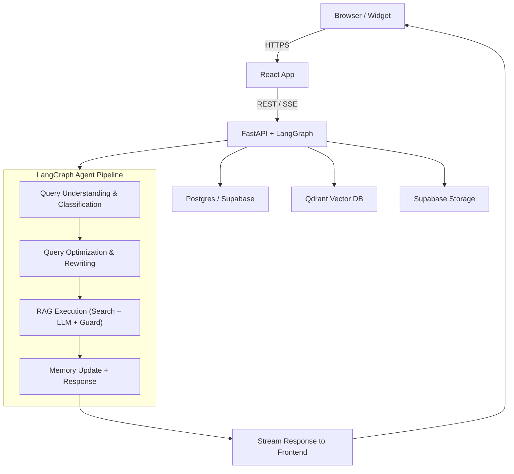
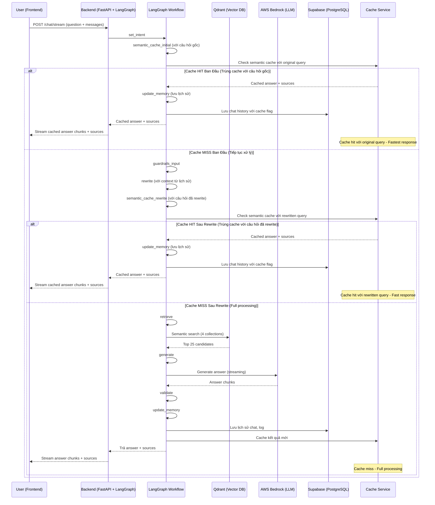

## 🛠️ Workflow Chi Tiết Toàn Bộ Hệ Thống

### 1. Luồng Xử Lý Tổng Thể (High-level System View)

### 2. Mô tả chi tiết từng bước

**A. Frontend (React 18)**
- Người dùng nhập câu hỏi và gửi request qua API `/chat/stream`.
- Gửi kèm mảng `messages` chứa lịch sử hội thoại.
- **Nhận kết quả trả về dạng streaming:**
  - Các chunk `"type": "chunk"` chứa nội dung trả lời.
  - Chunk `"type": "sources"` chứa metadata nguồn tham khảo (bao gồm cả file mẫu, link tải về...).
- **Hiển thị:**
  - Nội dung trả lời.
  - Nếu có file mẫu trong sources, **hiện nút tải về nổi bật** phía dưới.
  - Khi bấm "Hiện nguồn tham khảo", hiển thị đúng thông tin nguồn (luật hoặc biểu mẫu, có link tải nếu là mẫu).

**B. Backend (FastAPI + LangGraph)**
- Nhận request, sinh `session_id` nếu chưa có, chuẩn hóa lịch sử hội thoại.
- **LangGraph RAG Workflow:**

#### Bước 1-2: Kiểm tra cache ban đầu
1. **set_intent:** Phân loại intent (law, form, term, procedure, template, ambiguous).
2. **semantic_cache_initial:** Kiểm tra cache semantic với câu hỏi gốc.

#### Nhánh A: Cache Hit Ban Đầu (Trùng cache với câu hỏi gốc)
**Khi tìm thấy câu hỏi gốc tương tự trong cache:**
- **Lấy kết quả cache:** Trích xuất answer và sources từ cache
- **Cập nhật metadata:** Ghi log cache hit, thời gian xử lý
- **Stream kết quả:** Gửi cached answer và sources về frontend
- **Bỏ qua tất cả các bước:** Không cần xử lý thêm
- **Lưu lịch sử:** Vẫn lưu vào Supabase để tracking

#### Nhánh B: Cache Miss Ban Đầu (Tiếp tục xử lý)
**Khi không tìm thấy câu hỏi gốc trong cache:**
3. **guardrails_input:** Kiểm duyệt an toàn đầu vào (LlamaGuard Input). Nếu vi phạm, trả về thông báo an toàn.
4. **rewrite:** Làm sạch, paraphrase câu hỏi với context từ lịch sử hội thoại (rule-based + LLM nếu cần).
5. **semantic_cache_rewrite:** Kiểm tra cache semantic với câu hỏi đã được rewrite.

#### Nhánh B1: Cache Hit Sau Rewrite (Trùng cache với câu hỏi đã rewrite)
**Khi tìm thấy câu hỏi đã rewrite tương tự trong cache:**
- **Lấy kết quả cache:** Trích xuất answer và sources từ cache
- **Cập nhật metadata:** Ghi log cache hit với rewritten query
- **Stream kết quả:** Gửi cached answer và sources về frontend
- **Bỏ qua các bước:** Không cần retrieve, generate, validate
- **Lưu lịch sử:** Vẫn lưu vào Supabase để tracking

#### Nhánh B2: Cache Miss Sau Rewrite (Full processing)
**Khi không tìm thấy câu hỏi đã rewrite trong cache:**
6. **retrieve:** Tìm kiếm semantic trong các collection tương ứng (top 25).
7. **generate:** Tạo prompt động phù hợp intent, chèn context và metadata.
8. **validate:** Kiểm duyệt đầu ra (LlamaGuard Output).
9. **update_memory:** Lưu lại câu hỏi, câu trả lời, nguồn, intent, v.v. vào Supabase.
10. **Cache kết quả:** Lưu kết quả mới vào semantic cache cho lần sau.

### 3. Sơ Đồ Luồng Dữ Liệu Chi Tiết (Data Flow, LangGraph-based)

