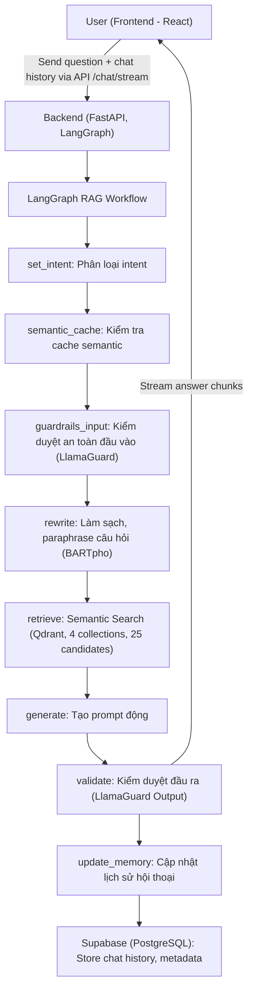
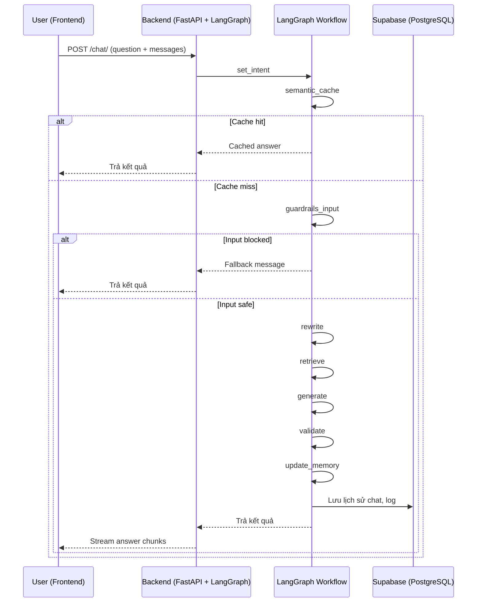

## 🛠️ Workflow Chi Tiết Toàn Bộ Hệ Thống (Cập nhật mới nhất)

### 1. Luồng Xử Lý Tổng Thể (LangGraph-based)

### 2. Mô tả chi tiết từng bước

**A. Frontend (React 18)**
- Người dùng nhập câu hỏi và gửi request qua API `/chat/` hoặc `/chat/stream`.
- Gửi kèm mảng `messages` chứa lịch sử hội thoại.
- Nhận câu trả lời trả về dạng streaming (từng đoạn text), lịch sử chat và trạng thái xử lý.

**B. Backend (FastAPI + LangGraph)**
- Nhận request, sinh `session_id` nếu chưa có, chuẩn hóa lịch sử hội thoại.
- **LangGraph RAG Workflow:**
  1. **set_intent:** Phân loại intent (law, form, term, procedure, ambiguous).
  2. **semantic_cache:** Kiểm tra cache semantic (embedding) với câu hỏi gốc. Nếu trùng, trả kết quả luôn.
  3. **guardrails_input:** Kiểm duyệt an toàn đầu vào (LlamaGuard Input). Nếu vi phạm, trả về thông báo an toàn.
  4. **rewrite:** Làm sạch, paraphrase câu hỏi với context (rule-based + LLM nếu cần).
  5. **retrieve:** Tìm kiếm semantic trong các collection tương ứng (top 25).
  6. **generate:** Tạo prompt động phù hợp intent, chèn context và metadata.
  7. **validate:** Kiểm duyệt đầu ra (LlamaGuard Output).
  8. **update_memory:** Lưu lại câu hỏi, câu trả lời, nguồn, intent, v.v. vào Supabase.
- **Trả kết quả:**
  - Stream từng đoạn text về frontend, giúp UI hiển thị liên tục theo thời gian thực.

### 3. Sơ Đồ Luồng Dữ Liệu (Data Flow, LangGraph-based)

### 4. Tóm tắt các bước chính

1. **set_intent:** Phân loại intent câu hỏi
2. **semantic_cache:** Trả kết quả nếu đã có trong cache semantic
3. **guardrails_input:** Kiểm duyệt an toàn đầu vào
4. **rewrite:** Làm sạch, paraphrase câu hỏi
5. **retrieve:** Semantic search + rerank
6. **generate:** Tạo prompt động
7. **validate:** Kiểm duyệt đầu ra
8. **update_memory:** Lưu lịch sử, metadata

### 5. Lưu ý
- Nếu **semantic cache hit**: trả kết quả luôn, bỏ qua các bước sau.
- Nếu **input bị block**: trả fallback message, bỏ qua các bước sau.
- Các bước còn lại thực hiện như pipeline cũ.

---

