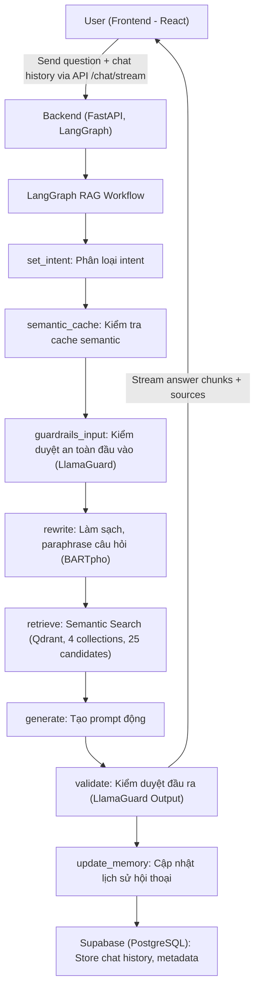
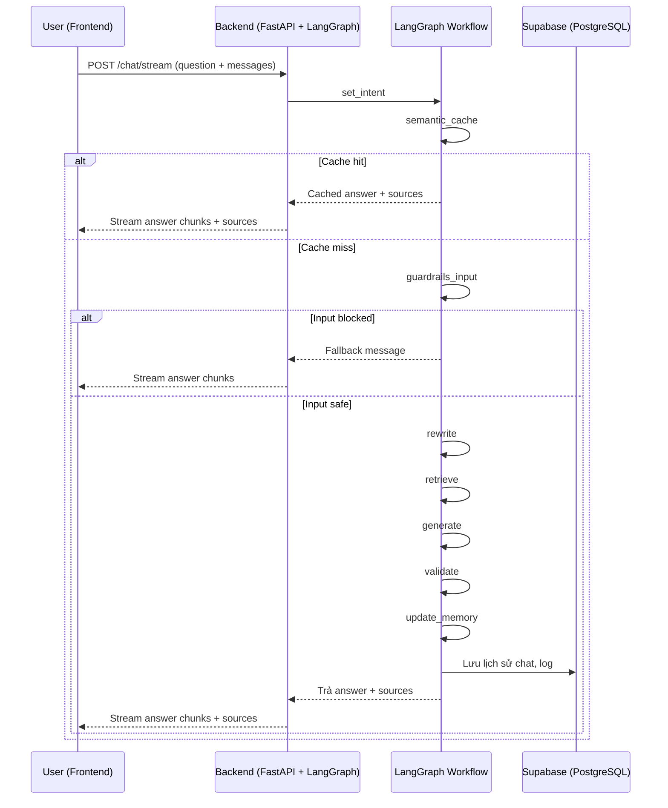

## 🛠️ Workflow Chi Tiết Toàn Bộ Hệ Thống (Cập nhật mới nhất)

### 1. Luồng Xử Lý Tổng Thể (LangGraph-based)

### 2. Mô tả chi tiết từng bước

**A. Frontend (React 18)**
- Người dùng nhập câu hỏi và gửi request qua API `/chat/stream`.
- Gửi kèm mảng `messages` chứa lịch sử hội thoại.
- **Nhận kết quả trả về dạng streaming:**
  - Các chunk `"type": "chunk"` chứa nội dung trả lời.
  - Chunk `"type": "sources"` chứa metadata nguồn tham khảo (bao gồm cả file mẫu, link tải về...).
- **Hiển thị:**
  - Nội dung trả lời (không còn link dài ngoằng).
  - Nếu có file mẫu trong sources, **hiện nút tải về nổi bật** phía dưới.
  - Khi bấm "Hiện nguồn tham khảo", hiển thị đúng thông tin nguồn (luật hoặc biểu mẫu, có link tải nếu là mẫu).

**B. Backend (FastAPI + LangGraph)**
- Nhận request, sinh `session_id` nếu chưa có, chuẩn hóa lịch sử hội thoại.
- **LangGraph RAG Workflow:**
  1. **set_intent:** Phân loại intent (law, form, term, procedure, template, ambiguous).
  2. **semantic_cache:** Kiểm tra cache semantic (embedding) với câu hỏi gốc. Nếu trùng, trả kết quả luôn.
  3. **guardrails_input:** Kiểm duyệt an toàn đầu vào (LlamaGuard Input). Nếu vi phạm, trả về thông báo an toàn.
  4. **rewrite:** Làm sạch, paraphrase câu hỏi với context (rule-based + LLM nếu cần).
  5. **retrieve:** Tìm kiếm semantic trong các collection tương ứng (top 25).
  6. **generate:** Tạo prompt động phù hợp intent, chèn context và metadata (bao gồm cả file_url, code, title... nếu là template).
  7. **validate:** Kiểm duyệt đầu ra (LlamaGuard Output).
  8. **update_memory:** Lưu lại câu hỏi, câu trả lời, nguồn, intent, v.v. vào Supabase.
- **Trả kết quả:**
  - **Stream từng chunk nội dung trả lời** về frontend.
  - **Sau khi stream xong, gửi chunk `"type": "sources"`** chứa metadata nguồn tham khảo (bao gồm cả file mẫu, link tải về...).

### 3. Sơ Đồ Luồng Dữ Liệu (Data Flow, LangGraph-based)

### 4. Tóm tắt các điểm mới nổi bật

- **Backend luôn trả về sources (bao gồm file_url, code, title...) trong chunk riêng biệt.**
- **Frontend tự động nhận sources và render nút tải về mẫu, hiển thị nguồn tham khảo đúng loại (luật, biểu mẫu...).**
- **Không còn link dài ngoằng trong nội dung trả lời.**
- **UX tốt hơn, người dùng dễ dàng tải file mẫu và xem nguồn tham khảo.**

### 5. Chi tiết xử lý sources

- **Backend:**
  - Khi truy vấn liên quan đến biểu mẫu, backend lấy metadata (file_url, code, title, ...) từ Qdrant hoặc nguồn dữ liệu.
  - Sau khi stream xong nội dung trả lời, backend gửi chunk `{"type": "sources", "sources": [...]}` cho frontend.
- **Frontend:**
  - Khi nhận chunk `type: sources`, frontend gán vào message bot cuối cùng.
  - Component Message.js sẽ tự động hiển thị nút tải về nếu có file_url, và hiển thị nguồn tham khảo đúng loại (luật, biểu mẫu, ...).

