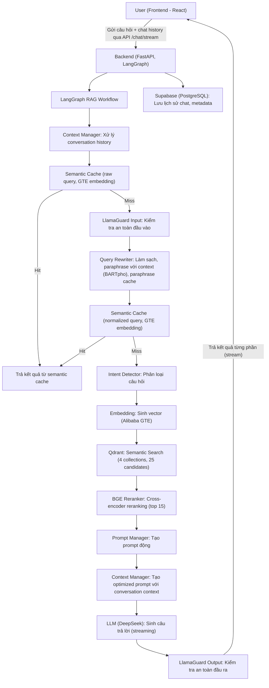
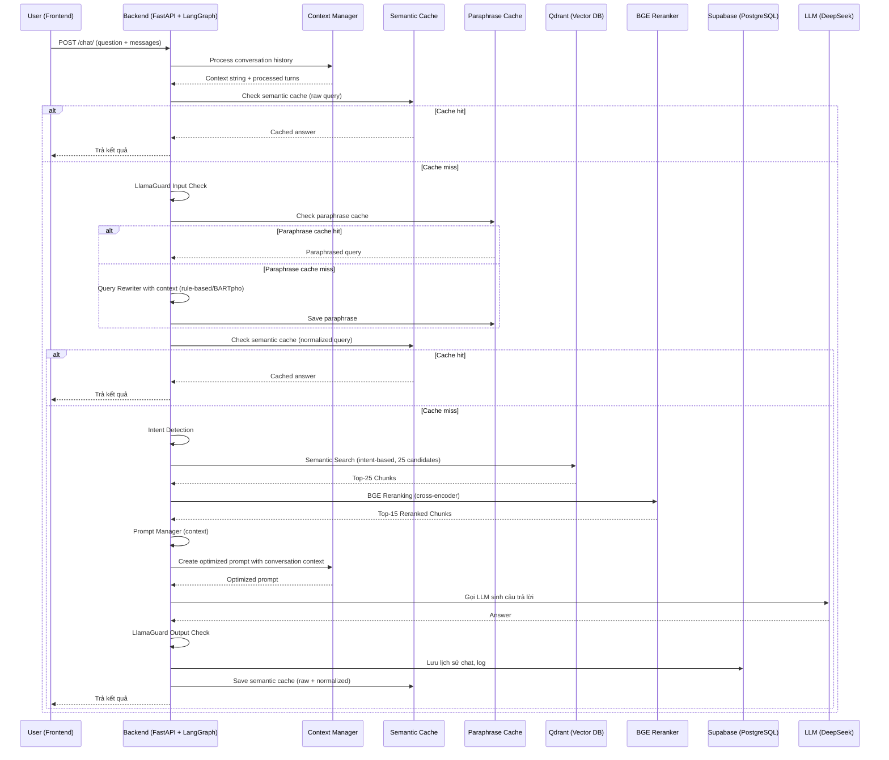

## 🛠️ Workflow Chi Tiết Toàn Bộ Hệ Thống (Cập nhật mới nhất)

### 1. Luồng Xử Lý Tổng Thể (LangGraph-based)

**Lưu ý:**
- Tất cả các endpoint chat (`/chat/`, `/chat/stream`, v.v.) hiện tại đều sử dụng LangGraph làm workflow chính.
- Các endpoint cũ đã bị deprecate và trả về lỗi 410 Gone.

### 2. Mô Tả Chi Tiết Từng Bước (LangGraph-based)

1. **Frontend (React 18)**
   - Người dùng nhập câu hỏi, gửi request qua API `/chat/` hoặc `/chat/stream`.
   - Gửi kèm `messages` array chứa lịch sử hội thoại.
   - Hiển thị kết quả trả về, lịch sử chat, trạng thái đang xử lý.

2. **Backend (FastAPI + LangGraph)**
   - Nhận request, sinh session_id nếu chưa có.
   - **LangGraph RAG Workflow:**
     - Tất cả các bước xử lý (context, cache, guardrails, rewriting, search, rerank, prompt, LLM, lưu lịch sử) được thực hiện trong workflow LangGraph.
     - Xử lý context, semantic cache, guardrails, query rewriting, intent detection, embedding, Qdrant search, BGE reranking, prompt, LLM, guardrails output, lưu cache và lịch sử.
   - Trả kết quả về frontend (answer, sources, intent, confidence, timestamp).

3. **Deprecation**
   - Các endpoint cũ trong `/chat` (trước đây không dùng LangGraph) đã bị vô hiệu hóa và trả về mã lỗi 410 Gone.
   - Vui lòng sử dụng endpoint `/chat` mới (LangGraph-powered).

### 3. Sơ Đồ Luồng Dữ Liệu (Data Flow, LangGraph-based)

