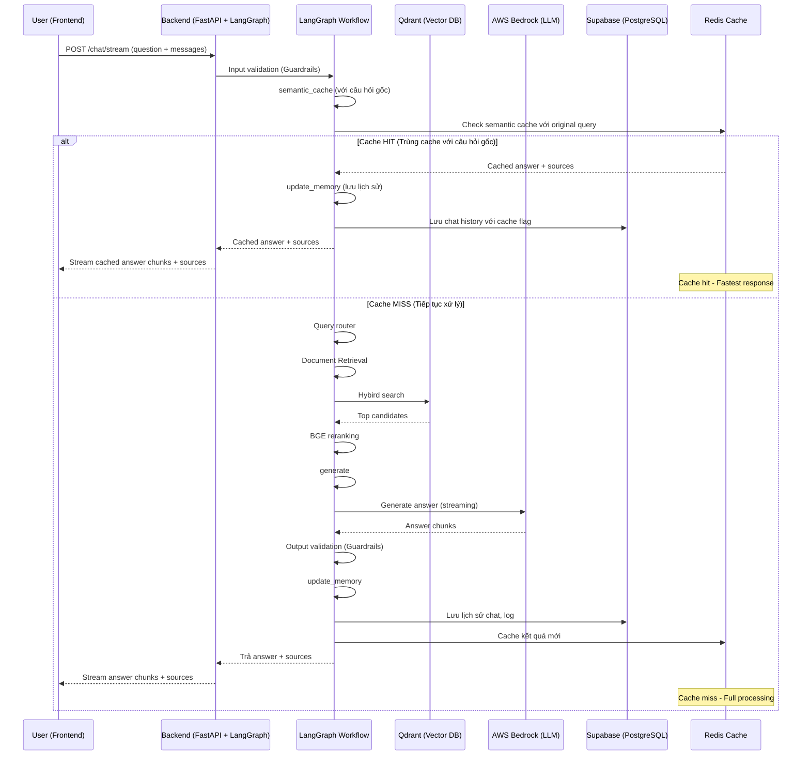

## 🛠️ Workflow Chi Tiết Toàn Bộ Hệ Thống

### 1. Luồng Xử Lý Tổng Thể (High-level System View)

```mermaid
graph TD

  %% Tầng giao diện ngÆ°á»i dùng chi tiết
  F1["Browser / Widget"] -->|HTTPS| F2["React App"] -->|REST / SSE| B1["FastAPI + LangGraph"]

  %% Dịch vụ phía sau
  B1 --> DB1["Postgres / Supabase"]
  B1 --> DB2["Qdrant Vector DB"]
  B1 --> DB3["Redis Cache"]
  B1 --> DB4["Supabase Storage"]

  %% LangGraph Agent Pipeline
  B1 --> C1["LangGraph Agent Pipeline"]

  subgraph C1 ["LangGraph Agent Pipeline"]
    direction TB
    C1A["Input Validation"]
    C1B["Semantic Cache Check"]
    C1C["Query Router"]
    C1D["Document Retrieval"]
    C1E["Answer Generation"]
    C1F["Output Validation"]
    C1G["Memory Update"]

    C1A --> C1B --> C1C --> C1D --> C1E --> C1F --> C1G
  end

  %% Output
  C1G --> D1["Stream Response to Frontend"] --> F1
```

### 2. Mô tả chi tiết từng bước

**A. Frontend (React 18)**

- Người dùng nhập câu hỏi và gửi request qua API `/chat/stream`.
- Gửi kèm mảng `messages` chứa lịch sử hội thoại.
- **Nhận kết quả trả về dạng streaming:**
  - Các chunk `"type": "chunk"` chứa nội dung trả lời.
  - Chunk `"type": "sources"` chứa metadata nguồn tham khảo (bao gồm cả file mẫu, link tải về...).
  - Chunk `"type": "done"` báo hiệu kết thúc stream.
- **Hiển thị:**
  - Nội dung trả lời real-time từng chunk.
  - Nếu có file mẫu trong sources, **hiện nút tải về nổi bật** phía dưới.
  - Khi bấm "Hiện nguồn tham khảo", hiển thị đúng thông tin nguồn (luật hoặc biểu mẫu, có link tải nếu là mẫu).

**B. Backend (FastAPI + LangGraph)**

- Nhận request, sinh `session_id` nếu chưa có, chuẩn hóa lịch sử hội thoại.
- **LangGraph RAG Workflow:**

#### Bước 1: Phân loại ý định (Intent Detection)

- **set_intent:** Phân loại intent (law, form, term, procedure, ambiguous, general).
- **Logic:** Sử dụng keyword-based detection với confidence scoring.
- **Output:** Primary intent và danh sách tất cả intents có thể.

#### Bước 2: Kiểm tra semantic cache

- **semantic_cache:** Kiểm tra cache semantic với câu hỏi gốc.
- **Logic:** Tạo embedding của câu hỏi, so sánh với cache entries trong Redis.
- **Threshold:** 0.85 similarity score.
- **Nếu cache hit:** Trả ngay kết quả và sources, bỏ qua các bước sau.

#### Bước 3: Kiểm duyệt an toàn đầu vào

- **guardrails_input:** Kiểm duyệt an toàn đầu vào (LlamaGuard Input).
- **Logic:** Sử dụng LlamaGuard 7B với policy từ `policy_input.yaml`.
- **Nếu vi phạm:** Trả về thông báo an toàn, không xử lý tiếp.

#### Bước 4: Làm sạch & cải thiện câu hỏi

- **rewrite:** Làm sạch, paraphrase câu hỏi với context từ lịch sử hội thoại.
- **Logic:** Kết hợp rule-based cleaning và LLM paraphrase nếu cần.
- **Context:** Sử dụng conversation history để hiểu ngữ cảnh.

#### Bước 5: Truy xuất thông tin semantic

- **retrieve:** Tìm kiếm semantic trong các collection tương ứng.
- **Logic:**
  - Dựa trên tất cả intents để chọn collections.
  - Tìm kiếm top 30 candidates từ mỗi collection.
  - Sử dụng BGE reranker để sắp xếp lại kết quả.
  - Đặc biệt xử lý LAW intent: gom nhóm theo parent_id và merge chunks.
- **Output:** Top 8 context documents.

#### Bước 6: Tạo prompt động & sinh câu trả lời

- **generate:** Tạo prompt động phù hợp intent, chèn context và metadata.
- **Logic:**
  - Chọn prompt template theo intent.
  - Format context documents với metadata.
  - Gọi AWS Bedrock (Llama 4 Scout 17B) để sinh câu trả lời.
  - Stream kết quả về frontend từng chunk.
- **Output:** Câu trả lời hoàn chỉnh và prompt để streaming.

#### Bước 7: Kiểm duyệt đầu ra

- **validate:** Kiểm duyệt đầu ra (LlamaGuard Output).
- **Logic:** Sử dụng LlamaGuard 7B với policy từ `policy_output.yaml`.
- **Nếu vi phạm:** Thay thế bằng thông báo an toàn.

#### Bước 8: Cập nhật bộ nhớ & cache

- **update_memory:** Lưu lại câu hỏi, câu trả lời, nguồn, intent, v.v. vào Supabase.
- **Logic:**
  - Cập nhật conversation history.
  - Tạo context summary.
  - Lưu metadata và processing time.
- **Cache:** Lưu kết quả mới vào semantic cache cho lần sau.

### 3. Sơ Đồ Luồng Dữ Liệu Chi Tiết (Data Flow, LangGraph-based)

### 4. Giải thích từng bước workflow

#### **Bước 1: Input validation (Kiểm duyệt đầu vào)**

- **Mục đích:** Đảm bảo câu hỏi không vi phạm chính sách an toàn.
- **Hoạt động:** Sử dụng LlamaGuard để kiểm tra nội dung câu hỏi.
- **Kết quả:** Chặn câu hỏi vi phạm và trả thông báo an toàn.

#### **Bước 2: Semantic Cache Check (Kiểm tra cache)**

- **Mục đích:** Tăng tốc độ phản hồi cho câu hỏi tương tự đã được trả lời trước đó.
- **Hoạt động:** Tạo embedding của câu hỏi, so sánh với cache entries trong Redis.
- **Kết quả:** Nếu tìm thấy câu hỏi tương tự (similarity ≥ 0.85), trả ngay kết quả cache.

#### **Bước 3: Query Router (Phân loại ý định)**

- **Mục đích:** Xác định loại câu hỏi để chọn đúng nguồn dữ liệu và cách trả lời.
- **Hoạt động:** Phân tích từ khóa trong câu hỏi, tính điểm confidence cho từng loại intent.
- **Kết quả:** Primary intent và danh sách tất cả intents có thể để tìm kiếm toàn diện.

#### **Bước 4: Hybird search (Truy xuất thông tin)**

- **Mục đích:** Tìm các tài liệu liên quan nhất để trả lời câu hỏi.
- **Hoạt động:**
  - Tìm kiếm trong các collection tương ứng với intent.
  - Sử dụng BGE reranker để sắp xếp lại theo độ phù hợp.
- **Kết quả:** Top 8 context documents có độ phù hợp cao nhất.

#### **Bước 5: Answer Generation (Sinh câu trả lời)**

- **Mục đích:** Tạo câu trả lời chính xác và hữu ích dựa trên context.
- **Hoạt động:**
  - Tạo prompt động theo intent và context.
  - Gọi LLM (Llama 4 Scout 17B) để sinh câu trả lời.
  - Stream kết quả về frontend từng chunk.
- **Kết quả:** Câu trả lời hoàn chỉnh và prompt để streaming.

#### **Bước 6: Output Validation (Kiểm duyệt đầu ra)**

- **Mục đích:** Đảm bảo câu trả lời không chứa nội dung nhạy cảm.
- **Hoạt động:** Sử dụng LlamaGuard để kiểm tra nội dung trả lời.
- **Kết quả:** Thay thế nội dung vi phạm bằng thông báo an toàn.

#### **Bước 7: Memory Update (Cập nhật bộ nhớ)**

- **Mục đích:** Lưu trữ thông tin để cải thiện trải nghiệm và phân tích.
- **Hoạt động:**
  - Cập nhật conversation history.
  - Tạo context summary cho lần sau.
  - Lưu metadata và thời gian xử lý từng bước.
  - Cache kết quả mới cho lần sau.
- **Kết quả:** Dữ liệu được lưu trữ để tracking và cải thiện hệ thống về sau.

### 5. Tối ưu hóa Performance

#### **Cache Strategy (Chiến lược cache)**

- **Semantic Cache:** Lưu trữ kết quả dựa trên embedding similarity.
- **Threshold:** 0.85 similarity score để đảm bảo chất lượng.
- **TTL:** 1 giờ cho cache entries.
- **Limit:** 1000 cached entries để tránh memory overflow.

#### **Streaming Response (Trả lời streaming)**

- **Server-Sent Events:** Sử dụng SSE để stream từng chunk về frontend.
- **Real-time Display:** Frontend hiển thị nội dung ngay khi nhận được chunk.
- **Buffer Management:** Xử lý buffer để đảm bảo smooth streaming.

#### **Parallel Processing (Xử lý song song)**

- **Async/Await:** Sử dụng async programming để tối ưu I/O operations.
- **ThreadPoolExecutor:** Xử lý CPU-intensive tasks trong thread pool.
- **Concurrent Retrieval:** Tìm kiếm song song trong nhiều collections.

### 6. Error Handling & Fallbacks

#### **Graceful Degradation (Giảm cấp độ mượt mà)**

- **Cache Failures:** Tiếp tục xử lý bình thường nếu cache không available.
- **LLM Failures:** Trả về thông báo lỗi thân thiện.
- **Vector DB Failures:** Fallback về keyword search.

#### **Retry Logic (Logic thử lại)**

- **Network Issues:** Tự động retry cho network failures.
- **Rate Limiting:** Exponential backoff cho API rate limits.
- **Timeout Handling:** Timeout cho các external services.

### 7. Monitoring & Observability

#### **Performance Tracking (Theo dõi hiệu suất)**

- **Step Timing:** Đo thời gian xử lý từng bước trong workflow.
- **Cache Metrics:** Hit rate, miss rate, response time.
- **LLM Metrics:** Token usage, response time, error rate.

#### **Error Monitoring (Theo dõi lỗi)**

- **Exception Logging:** Log chi tiết các exceptions.
- **Error Classification:** Phân loại lỗi theo type và severity.
- **Alert System:** Alert cho critical errors.
