## 🛠️ Workflow Chi Tiết Toàn Bộ Hệ Thống (Cập nhật mới nhất)

### 1. Luồng Xử Lý Tổng Thể (LangGraph-based)

### 2. Step-by-step Workflow Explanation

**A. Frontend (React 18)**
- User enters a question and sends a request via API `/chat/` or `/chat/stream`.
- Sends a `messages` array containing the chat history.
- Receives the answer as a streaming response (text chunks), chat history, and processing status.

**B. Backend (FastAPI + LangGraph)**
- Receives the request, generates a `session_id` if not provided, and normalizes the chat history.
- **LangGraph RAG Workflow:**
  - **Context Manager:** Processes, summarizes, and selects the most relevant conversation turns (limits to 3-5 turns, summarizes if too long).
  - **Semantic Cache:** Checks semantic cache (embedding) with the original question. If hit, returns the cached answer immediately.
  - **Guardrails Input:** Checks input safety (LlamaGuard).
  - **Query Rewriter:** Cleans and paraphrases the question with context (rule-based + LLM if needed).
  - **Semantic Cache (normalized):** Checks cache with the rewritten question.
  - **Intent Detector:** Classifies intent (law, form, term, procedure, ambiguous).
  - **Embedding:** Generates embedding vector for the question (PhoBERT/GTE).
  - **Qdrant Search:** Performs semantic search in the relevant collections (top 25).
  - **BGE Reranker:** Reranks results using cross-encoder, selects top 15.
  - **Prompt Manager:** Builds a dynamic prompt suitable for the intent, inserts context and metadata.
  - **LLM (DeepSeek):** Generates the answer based on the prompt (streams text chunks).
  - **Guardrails Output:** Checks output safety (LlamaGuard).
  - **History Storage:** Saves the question, answer, sources, intent, etc. to Supabase.
- **Returns the result:**
  - Streams answer chunks to the frontend, enabling real-time UI updates.

### 3. Sơ Đồ Luồng Dữ Liệu (Data Flow, LangGraph-based)

```mermaid
sequenceDiagram
    participant U as User (Frontend)
    participant B as Backend (FastAPI + LangGraph)
    participant CM as Context Manager
    participant C as Semantic Cache
    participant P as Paraphrase Cache
    participant Q as Qdrant (Vector DB)
    participant R as BGE Reranker
    participant S as Supabase (PostgreSQL)
    participant L as LLM (DeepSeek)
    U->>B: POST /chat/ (question + messages)
    B->>CM: Process conversation history
    CM-->>B: Context string + processed turns
    B->>C: Check semantic cache (raw query)
    alt Cache hit
        C-->>B: Cached answer
        B-->>U: Trả kết quả
    else Cache miss
    B->>B: LlamaGuard Input Check
        B->>P: Check paraphrase cache
        alt Paraphrase cache hit
            P-->>B: Paraphrased query
        else Paraphrase cache miss
            B->>B: Query Rewriter with context (rule-based/BARTpho)
            B->>P: Save paraphrase
        end
        B->>C: Check semantic cache (normalized query)
        alt Cache hit
            C-->>B: Cached answer
            B-->>U: Trả kết quả
        else Cache miss
    B->>B: Intent Detection
    B->>Q: Semantic Search (intent-based, 25 candidates)
    Q-->>B: Top-25 Chunks
    B->>R: BGE Reranking (cross-encoder)
    R-->>B: Top-15 Reranked Chunks
    B->>B: Prompt Manager (context)
    B->>CM: Create optimized prompt with conversation context
    CM-->>B: Optimized prompt
    B->>L: Gọi LLM sinh câu trả lời
    L-->>B: Answer
    B->>B: LlamaGuard Output Check
    B->>S: Lưu lịch sử chat, log
            B->>C: Save semantic cache (raw + normalized)
            B-->>U: Trả kết quả
        end
    end
```

