## 🛠️ Workflow Chi Tiết Toàn Bộ Hệ Thống (Cập nhật mới nhất - LangGraph-based)

### 1. Luồng Xử Lý Tổng Thể (LangGraph-based)

```mermaid
graph TD;
  A["User (Frontend - React)"] -->|"Send question + chat history via API /chat/stream"| B["Backend (FastAPI, LangGraph)"]
  B --> C0["LangGraph RAG Workflow"]
  C0 --> C1["set_intent: Phân loại intent"]
  C1 --> C2["semantic_cache_initial: Kiểm tra cache với câu hỏi gốc"]
  
  C2 --> C3{Cache Hit?}
  C3 -->|YES| C4["Return cached answer + sources"]
  C3 -->|NO| C5["guardrails_input: Kiểm duyệt an toàn đầu vào (LlamaGuard)"]
  
  C5 --> C6["rewrite: Làm sạch, paraphrase câu hỏi với context"]
  C6 --> C7["semantic_cache_rewrite: Kiểm tra cache với câu hỏi đã rewrite"]
  
  C7 --> C8{Cache Hit?}
  C8 -->|YES| C9["Return cached answer + sources"]
  C8 -->|NO| C10["retrieve: Semantic Search (Qdrant, 4 collections, 25 candidates)"]
  
  C10 --> C11["generate: Tạo prompt động + gọi LLM (AWS Bedrock)"]
  C11 --> C12["validate: Kiểm duyệt đầu ra (LlamaGuard Output)"]
  C12 --> C13["update_memory: Cập nhật lịch sử hội thoại"]
  C13 --> D["Supabase (PostgreSQL): Store chat history, metadata"]
  
  C4 --> E["Stream cached answer + sources to Frontend"]
  C9 --> F["Stream cached answer + sources to Frontend"]
  C11 --> G["Stream answer chunks + sources to Frontend"]
  
  E --> A
  F --> A
  G --> A
```


### 2. Mô tả chi tiết từng bước

**A. Frontend (React 18)**
- Người dùng nhập câu hỏi và gửi request qua API `/chat/stream`.
- Gửi kèm mảng `messages` chứa lịch sử hội thoại.
- **Nhận kết quả trả về dạng streaming:**
  - Các chunk `"type": "chunk"` chứa nội dung trả lời.
  - Chunk `"type": "sources"` chứa metadata nguồn tham khảo (bao gồm cả file mẫu, link tải về...).
- **Hiển thị:**
  - Nội dung trả lời.
  - Nếu có file mẫu trong sources, **hiện nút tải về nổi bật** phía dưới.
  - Khi bấm "Hiện nguồn tham khảo", hiển thị đúng thông tin nguồn (luật hoặc biểu mẫu, có link tải nếu là mẫu).

**B. Backend (FastAPI + LangGraph)**
- Nhận request, sinh `session_id` nếu chưa có, chuẩn hóa lịch sử hội thoại.
- **LangGraph RAG Workflow:**

#### Bước 1-2: Kiểm tra cache ban đầu
1. **set_intent:** Phân loại intent (law, form, term, procedure, template, ambiguous).
2. **semantic_cache_initial:** Kiểm tra cache semantic với câu hỏi gốc.

#### Nhánh A: Cache Hit Ban Đầu (Trùng cache với câu hỏi gốc)
**Khi tìm thấy câu hỏi gốc tương tự trong cache:**
- **Lấy kết quả cache:** Trích xuất answer và sources từ cache
- **Cập nhật metadata:** Ghi log cache hit, thời gian xử lý
- **Stream kết quả:** Gửi cached answer và sources về frontend
- **Bỏ qua tất cả các bước:** Không cần xử lý thêm
- **Lưu lịch sử:** Vẫn lưu vào Supabase để tracking

#### Nhánh B: Cache Miss Ban Đầu (Tiếp tục xử lý)
**Khi không tìm thấy câu hỏi gốc trong cache:**
3. **guardrails_input:** Kiểm duyệt an toàn đầu vào (LlamaGuard Input). Nếu vi phạm, trả về thông báo an toàn.
4. **rewrite:** Làm sạch, paraphrase câu hỏi với context từ lịch sử hội thoại (rule-based + LLM nếu cần).
5. **semantic_cache_rewrite:** Kiểm tra cache semantic với câu hỏi đã được rewrite.

#### Nhánh B1: Cache Hit Sau Rewrite (Trùng cache với câu hỏi đã rewrite)
**Khi tìm thấy câu hỏi đã rewrite tương tự trong cache:**
- **Lấy kết quả cache:** Trích xuất answer và sources từ cache
- **Cập nhật metadata:** Ghi log cache hit với rewritten query
- **Stream kết quả:** Gửi cached answer và sources về frontend
- **Bỏ qua các bước:** Không cần retrieve, generate, validate
- **Lưu lịch sử:** Vẫn lưu vào Supabase để tracking

#### Nhánh B2: Cache Miss Sau Rewrite (Full processing)
**Khi không tìm thấy câu hỏi đã rewrite trong cache:**
6. **retrieve:** Tìm kiếm semantic trong các collection tương ứng (top 25).
7. **generate:** Tạo prompt động phù hợp intent, chèn context và metadata.
8. **validate:** Kiểm duyệt đầu ra (LlamaGuard Output).
9. **update_memory:** Lưu lại câu hỏi, câu trả lời, nguồn, intent, v.v. vào Supabase.
10. **Cache kết quả:** Lưu kết quả mới vào semantic cache cho lần sau.

### 3. Sơ Đồ Luồng Dữ Liệu Chi Tiết (Data Flow, LangGraph-based)

```mermaid
sequenceDiagram
    participant U as User (Frontend)
    participant B as Backend (FastAPI + LangGraph)
    participant L as LangGraph Workflow
    participant Q as Qdrant (Vector DB)
    participant LLM as AWS Bedrock (LLM)
    participant S as Supabase (PostgreSQL)
    participant C as Cache Service
    
    U->>B: POST /chat/stream (question + messages)
    B->>L: set_intent
    L->>L: semantic_cache_initial (với câu hỏi gốc)
    L->>C: Check semantic cache với original query
    
    alt Cache HIT Ban Đầu (Trùng cache với câu hỏi gốc)
        C-->>L: Cached answer + sources
        L->>L: update_memory (lưu lịch sử)
        L->>S: Lưu chat history với cache flag
        L-->>B: Cached answer + sources
        B-->>U: Stream cached answer chunks + sources
        Note over C: Cache hit với original query - Fastest response
        
    else Cache MISS Ban Đầu (Tiếp tục xử lý)
        L->>L: guardrails_input
        L->>L: rewrite (với context từ lịch sử)
        L->>L: semantic_cache_rewrite (với câu hỏi đã rewrite)
        L->>C: Check semantic cache với rewritten query
        
        alt Cache HIT Sau Rewrite (Trùng cache với câu hỏi đã rewrite)
            C-->>L: Cached answer + sources
            L->>L: update_memory (lưu lịch sử)
            L->>S: Lưu chat history với cache flag
            L-->>B: Cached answer + sources
            B-->>U: Stream cached answer chunks + sources
            Note over C: Cache hit với rewritten query - Fast response
            
        else Cache MISS Sau Rewrite (Full processing)
            L->>L: retrieve
            L->>Q: Semantic search (4 collections)
            Q-->>L: Top 25 candidates
            L->>L: generate
            L->>LLM: Generate answer (streaming)
            LLM-->>L: Answer chunks
            L->>L: validate
            L->>L: update_memory
            L->>S: Lưu lịch sử chat, log
            L->>C: Cache kết quả mới
            L-->>B: Trả answer + sources
            B-->>U: Stream answer chunks + sources
            Note over C: Cache miss - Full processing
        end
    end
```



### 4. Chi Tiết Xử Lý Cache Hit vs Cache Miss

#### 🚀 **Cache Hit Ban Đầu (Fastest):**
```json
{
  "processing_flow": "cache_hit_initial",
  "steps_executed": ["set_intent", "semantic_cache_initial"],
  "cache_data": {
    "original_query": "Làm thế nào để đăng ký thường trú?",
    "cached_answer": "Để đăng ký thường trú, bạn cần...",
    "cached_sources": [...],
    "cache_timestamp": "2024-01-15T10:30:00Z",
    "similarity_score": 0.98
  },
  "performance_metrics": {
    "total_processing_time": "0.1s",
    "cache_lookup_time": "0.02s",
    "saved_processing_time": "4.1s"
  }
}
```

#### ⚡ **Cache Hit Sau Rewrite (Fast):**
```json
{
  "processing_flow": "cache_hit_rewrite",
  "steps_executed": ["set_intent", "semantic_cache_initial", "guardrails_input", "rewrite", "semantic_cache_rewrite"],
  "cache_data": {
    "original_query": "Làm thế nào?",
    "rewritten_query": "Làm thế nào để đăng ký thường trú theo quy định hiện hành?",
    "cached_answer": "Để đăng ký thường trú, bạn cần...",
    "cached_sources": [...],
    "cache_timestamp": "2024-01-15T10:30:00Z",
    "similarity_score": 0.95
  },
  "performance_metrics": {
    "total_processing_time": "0.3s",
    "cache_lookup_time": "0.05s",
    "saved_processing_time": "3.9s"
  }
}
```

#### 🔄 **Cache Miss (Full Processing):**
```json
{
  "processing_flow": "cache_miss_full",
  "steps_executed": ["set_intent", "semantic_cache_initial", "guardrails_input", "rewrite", "semantic_cache_rewrite", "retrieve", "generate", "validate", "update_memory"],
  "processing_details": {
    "intent": "procedure",
    "confidence": 0.89,
    "collections_searched": ["procedure_chunks", "legal_chunks"],
    "documents_retrieved": 25,
    "documents_reranked": 8,
    "llm_model": "llama-4-scout-17b",
    "prompt_tokens": 2048,
    "response_tokens": 512
  },
  "performance_metrics": {
    "total_processing_time": "4.2s",
    "retrieval_time": "0.8s",
    "generation_time": "2.5s",
    "validation_time": "0.3s"
  }
}
```

### 5. Cấu trúc dữ liệu và API

**ChatRequest:**
```json
{
  "question": "string",
  "session_id": "string (optional)",
  "messages": [
    {"role": "user|assistant", "content": "string"}
  ]
}
```

**Streaming Response:**
```json
// Chunk nội dung
{"type": "chunk", "content": "string"}

// Sources metadata
{"type": "sources", "sources": [
  {
    "title": "string",
    "code": "string",
    "file_url": "string",
    "url": "string",
    "content": "string",
    "metadata": {}
  }
]}

// Kết thúc
{"type": "done"}
```

### 6. Chi tiết xử lý sources

- **Backend:**
  - Khi truy vấn liên quan đến biểu mẫu, backend lấy metadata (file_url, code, title, ...) từ Qdrant hoặc nguồn dữ liệu.
  - Sau khi stream xong nội dung trả lời, backend gửi chunk `{"type": "sources", "sources": [...]}` cho frontend.
- **Frontend:**
  - Khi nhận chunk `type: sources`, frontend gán vào message bot cuối cùng.
  - Component Message.js sẽ tự động hiển thị nút tải về nếu có file_url, và hiển thị nguồn tham khảo đúng loại (luật, biểu mẫu, ...).

### 7. Tối Ưu Hóa Hiệu Suất

#### 🚀 **Cache Hit Ban Đầu (Fastest):**
- **Thời gian phản hồi:** Giảm từ ~4s xuống ~0.1s
- **Tiết kiệm tài nguyên:** Không cần xử lý gì thêm
- **Trải nghiệm người dùng:** Phản hồi cực nhanh
- **Chi phí:** Tiết kiệm tối đa API calls

#### ⚡ **Cache Hit Sau Rewrite (Fast):**
- **Thời gian phản hồi:** Giảm từ ~4s xuống ~0.3s
- **Tiết kiệm tài nguyên:** Không cần gọi LLM và search
- **Trải nghiệm người dùng:** Phản hồi nhanh
- **Chi phí:** Giảm chi phí API calls

#### 📊 **Cache Miss (Full Processing):**
- **Full RAG pipeline:** Chạy đầy đủ 10 bước
- **Semantic search:** Tìm kiếm trong 4 collections
- **LLM generation:** Tạo câu trả lời mới
- **Quality assurance:** Validate an toàn
- **Cache storage:** Lưu kết quả cho lần sau

### 8. Tóm tắt các điểm mới nổi bật

- **Backend luôn trả về sources (bao gồm file_url, code, title...) trong chunk riêng biệt.**
- **Frontend tự động nhận sources và render nút tải về mẫu, hiển thị nguồn tham khảo đúng loại (luật, biểu mẫu...).**
- **Không còn link dài ngoằng trong nội dung trả lời.**
- **UX tốt hơn, người dùng dễ dàng tải file mẫu và xem nguồn tham khảo.**
- **LangGraph workflow với 10 bước xử lý tuần tự.**
- **Streaming thực sự từ AWS Bedrock LLM.**
- **Double semantic cache: Kiểm tra cache với câu hỏi gốc và câu hỏi đã rewrite.**
- **Guardrails an toàn đầu vào và đầu ra.**
- **Xử lý thông minh cho 3 scenarios: cache hit ban đầu, cache hit sau rewrite, và cache miss với performance metrics chi tiết.**


