## 🛠️ Workflow Chi Tiết Toàn Bộ Hệ Thống

### 1. Luồng Xử Lý Tổng Thể

```mermaid
graph TD;
  A["User (Frontend - React)"] -->|"Gửi câu hỏi qua API /chat/"| B["Backend (FastAPI)"]
  B --> C1["Guardrails: Kiểm tra an toàn đầu vào"]
  C1 --> C2["Intent Detector: Phân loại câu hỏi"]
  C2 --> C3["Query Rewriter: Làm sạch & tối ưu câu hỏi"]
  C3 --> C4["Embedding: Sinh vector (PhoBERT)"]
  C4 --> C5["Qdrant: Semantic Search (4 collections)"]
  C5 --> C6["Prompt Manager: Tạo prompt động"]
  C6 --> C7["LLM (DeepSeek): Sinh câu trả lời"]
  C7 --> C8["Guardrails: Kiểm tra an toàn đầu ra"]
  C8 -->|"Trả kết quả"| A
  B --> D["Supabase (PostgreSQL): Lưu lịch sử chat, metadata"]
```

### 2. Mô Tả Chi Tiết Từng Bước

1. **Frontend (React 18)**
   - Người dùng nhập câu hỏi, gửi request qua API `/chat/` hoặc `/chat/stream`.
   - Hiển thị kết quả trả về, lịch sử chat, trạng thái đang xử lý.

2. **Backend (FastAPI)**
   - Nhận request, sinh session_id nếu chưa có.
   - Gọi Guardrails kiểm tra an toàn đầu vào (từ khóa cấm, PII, OpenAI Moderation, policy).
   - Nếu an toàn, chuyển sang Intent Detector để xác định loại câu hỏi (law, form, term, procedure, ambiguous).
   - Gọi Query Rewriter để làm sạch, tối ưu câu hỏi (rule-based + LLM paraphrase nếu cần).
   - Sinh embedding cho câu hỏi bằng PhoBERT.
   - Truy vấn Qdrant (vector DB) theo intent, lấy các chunk liên quan từ 1 hoặc nhiều collection.
   - Gọi Prompt Manager để tạo prompt động, format context phù hợp intent.
   - Gọi LLM (DeepSeek V3) sinh câu trả lời dựa trên prompt và context.
   - Kiểm tra an toàn đầu ra bằng Guardrails (content safety, policy).
   - Lưu lịch sử chat, metadata vào Supabase (PostgreSQL).
   - Trả kết quả về frontend (answer, sources, intent, confidence, timestamp).

3. **Qdrant (Vector DB)**
   - Lưu trữ embedding của 4 loại dữ liệu (laws, forms, terms, procedures).
   - Hỗ trợ truy vấn semantic search theo vector embedding.
   - Trả về các chunk dữ liệu liên quan nhất cho backend.

4. **Supabase (PostgreSQL)**
   - Lưu trữ dữ liệu gốc (laws, forms, terms, procedures).
   - Lưu lịch sử hội thoại, metadata, log intent detection, performance.
   - Hỗ trợ truy vấn lịch sử chat, thống kê, monitoring.

5. **Các Agent & Service**
   - **Guardrails**: 4 lớp bảo vệ an toàn input/output.
   - **Intent Detector**: Phân loại intent, routing collection.
   - **Query Rewriter**: Làm sạch, tối ưu, paraphrase câu hỏi.
   - **Prompt Manager**: Sinh prompt động, format context.
   - **LLM Service**: Gọi model DeepSeek V3 sinh câu trả lời.
   - **Embedding Service**: Sinh embedding bằng PhoBERT.
   - **Qdrant Service**: Truy vấn vector DB, trả về chunk liên quan.
   - **Supabase Service**: Lưu/log dữ liệu, truy vấn lịch sử.

### 3. Sơ Đồ Luồng Dữ Liệu (Data Flow)

```mermaid
sequenceDiagram
    participant U as User (Frontend)
    participant B as Backend (FastAPI)
    participant Q as Qdrant (Vector DB)
    participant S as Supabase (PostgreSQL)
    participant L as LLM (DeepSeek)
    U->>B: POST /chat/ (question)
    B->>B: Guardrails Input Check
    B->>B: Intent Detection
    B->>B: Query Rewriter
    B->>B: Embedding (PhoBERT)
    B->>Q: Semantic Search (intent-based)
    Q-->>B: Top-k Chunks
    B->>B: Prompt Manager (context)
    B->>L: Gọi LLM sinh câu trả lời
    L-->>B: Answer
    B->>B: Guardrails Output Check
    B->>S: Lưu lịch sử chat, log
    B-->>U: Trả kết quả (answer, sources, intent, ...)
```

### 4. Tổng Kết
- Workflow đảm bảo bảo mật, kiểm soát chất lượng, tối ưu tốc độ.
- Mọi bước đều có log, kiểm tra an toàn, và có thể mở rộng dễ dàng.
- Hỗ trợ cả truy vấn real-time (stream) và lưu trữ lịch sử đầy đủ. 